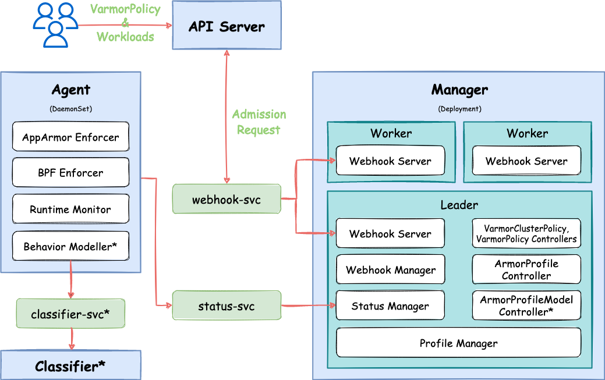

<div>
    <picture>
        <source media="(prefers-color-scheme: light)" srcset="docs/img/logo.svg" width="400">
        
    </picture>
</div>
<br>


[](https://goreportcard.com/report/github.com/bytedance/vArmor)
[](https://opensource.org/licenses/Apache-2.0)
[](https://opensource.org/license/gpl-2-0)
[](https://github.com/bytedance/vArmor/releases)

[English](README.md) | [简体中文](README.zh_CN.md) | 日本語

## 紹介

vArmorは、Linuxの[AppArmor LSM](https://en.wikipedia.org/wiki/AppArmor)、[BPF LSM](https://docs.kernel.org/bpf/prog_lsm.html)、および[Seccomp](https://en.wikipedia.org/wiki/Seccomp)技術を活用して、強制アクセス制御を実装するクラウドネイティブなコンテナサンドボックスシステムです。これにより、コンテナの隔離を強化し、カーネルの攻撃面を減らし、コンテナのエスケープや横移動攻撃の難易度とコストを増加させることができます。vArmorは、以下のシナリオでKubernetesクラスター内のコンテナにサンドボックス保護を提供するために使用できます。
* マルチテナント環境では、コストや技術的条件などの要因により、ハードウェア仮想化コンテナソリューションを使用できません。
* 重要なビジネスコンテナのセキュリティを強化し、攻撃者が特権をエスカレートしたり、エスケープしたり、横移動するのを困難にする必要がある場合。
* 高リスクの脆弱性が存在するが、パッチ適用が難しいまたは時間がかかるため、即座に修正できない場合に、vArmorを使用してリスクを軽減し、攻撃の難易度を増加させることができます（脆弱性の種類や攻撃ベクトルに依存します）。

**vArmorの特徴:**
* クラウドネイティブ。vArmorはKubernetes Operator設計パターンに従い、ユーザーが[CRD API](https://kubernetes.io/docs/concepts/extend-kubernetes/api-extension/custom-resources/)を操作して特定のワークロードを強化できるようにします。このアプローチにより、ビジネスニーズに密接に関連した視点から、コンテナ化されたマイクロサービスのサンドボックス化が可能になります。
* AppArmor、BPF、Seccompエンフォーサーを個別または組み合わせて使用し、コンテナのファイルアクセス、プロセス実行、ネットワーク外部接続、システムコールなどに強制アクセス制御を実施します。
* Allow by Defaultセキュリティモデルをサポートし、明示的に宣言された動作のみがブロックされるため、パフォーマンスへの影響を最小限に抑え、使いやすさを向上させます。
* 行動モデリングをサポートし、行動モデルに基づいて保護を提供します。これにより、明示的に宣言された動作のみが許可されます。
* すぐに使用可能。vArmorには、直接使用できる複数の組み込みルールが含まれています。

vArmorは、ByteDanceのエンドポイントセキュリティ部門の**Elkeid Team**によって作成されました。プロジェクトは現在も積極的に開発中です。

*注意: 厳格な隔離要件を満たすためには、計算隔離のためにハードウェア仮想化コンテナ（例：Kata Containers）を優先的に使用し、CNIのNetworkPolicyによるネットワーク隔離と組み合わせることをお勧めします。*

## アーキテクチャ


## 前提条件
ポリシーオブジェクト（[VarmorPolicy](docs/usage_instructions.md#varmorpolicy)/[VarmorClusterPolicy](docs/usage_instructions.md#varmorclusterpolicy)）の`spec.policy.enforcer`フィールドを使用してエンフォーサーを指定できます。さらに、異なるエンフォーサーを個別または組み合わせて使用することもできます。例：AppArmorBPF、AppArmorSeccomp、AppArmorBPFSeccompなど。

異なるエンフォーサーに必要な前提条件は以下の表に示されています。

|エンフォーサー|要件|推奨|
|------------|--------------------------------------------|--------|
|AppArmor    |1. Linux Kernel 4.15以上<br>2. AppArmor LSMが有効化されていること|GKE with Container-Optimized OS<br>AKS with Ubuntu 22.04 LTS<br>[VKE](https://www.volcengine.com/product/vke) with veLinux 1.0<br>Debian 10以上<br>Ubuntu 18.04.0 LTS以上<br>[veLinux 1.0](https://www.volcengine.com/docs/6396/74967)など|
|BPF         |1. Linux Kernel 5.10以上 (x86_64)<br>2. containerd v1.6.0以上<br>3. BPF LSMが有効化されていること|EKS with Amazon Linux 2<br>GKE with Container-Optimized OS<br>[VKE](https://www.volcengine.com/product/vke) with veLinux 1.0 (with 5.10 kernel)<br>AKS with Ubuntu 22.04 LTS <sup>\*</sup><br>ACK with Alibaba Cloud Linux 3 <sup>\*</sup><br>OpenSUSE 15.4 <sup>\*</sup><br>Debian 11 <sup>\*</sup><br>Fedora 37 <br>[veLinux 1.0 with 5.10 kernel](https://www.volcengine.com/docs/6396/74967)など<br><br>* *BPF LSMの手動有効化が必要です*|
|Seccomp     |1. Kubernetes v1.19以上|すべてのLinuxディストリビューション|

## ポリシーモードと組み込みルール

vArmorポリシーは、**AlwaysAllow、RuntimeDefault、EnhanceProtect、BehaviorModeling、DefenseInDepth**の5つのモードで動作します。ポリシーが**EnhanceProtect**モードで動作している場合、組み込みルールとカスタムインターフェースを使用してコンテナを強化できます。

詳細については、[ポリシーモードと組み込みルール](docs/built_in_rules.md)を参照してください。

## クイックスタート

詳細な設定オプションと使用手順については、[使用手順](docs/usage_instructions.md)を参照してください。関連機能の使用方法とポリシーの作成方法を理解するために、[例](test/examples)を参照できます。また、[policy-advisor](tools/policy-advisor/README.md)を使用してポリシーテンプレートを生成し、それに基づいて最終的なポリシーを作成することもできます。

### ステップ1. チャートの取得
```
helm pull oci://elkeid-ap-southeast-1.cr.volces.com/varmor/varmor --version 0.5.11
```

### ステップ2. インストール
*中国地域内では、ドメイン`elkeid-cn-beijing.cr.volces.com`を使用できます。*
```
helm install varmor varmor-0.5.11.tgz \
    --namespace varmor --create-namespace \
    --set image.registry="elkeid-ap-southeast-1.cr.volces.com"
```

### ステップ3. この例を試してみてください
```
# デモ用の名前空間を作成
kubectl create namespace demo

# VarmorPolicyオブジェクトを作成し、.spec.target.selectorに一致するDeploymentにAlwaysAllowモードのサンドボックスを有効にする
kubectl create -f test/examples/1-apparmor/vpol-apparmor-alwaysallow.yaml

# VarmorPolicy & ArmorProfileオブジェクトのステータスを表示
kubectl get VarmorPolicy -n demo
kubectl get ArmorProfile -n demo

# 対象のDeploymentオブジェクトを作成
kubectl create -f test/examples/1-apparmor/deploy.yaml

# 対象のDeploymentオブジェクトのPod名を取得
POD_NAME=$(kubectl get Pods -n demo -l app=demo-1 -o name)

# コンテナc1でコマンドを実行してシークレットトークンを読み取る
kubectl exec -n demo $POD_NAME -c c1 -- cat /run/secrets/kubernetes.io/serviceaccount/token

# VarmorPolicyオブジェクトを更新して、コンテナc1がシークレットトークンを読み取るのを禁止する
kubectl apply -f test/examples/1-apparmor/vpol-apparmor-enhance.yaml

# コンテナc1でコマンドを実行してシークレットトークンを読み取ることが禁止されていることを確認
kubectl exec -n demo $POD_NAME -c c1 -- cat /run/secrets/kubernetes.io/serviceaccount/token

# VarmorPolicyおよびDeploymentオブジェクトを削除
kubectl delete -f test/examples/1-apparmor/vpol-apparmor-alwaysallow.yaml
kubectl delete -f test/examples/1-apparmor/deploy.yaml
```

### ステップ4. アンインストール
```
helm uninstall varmor -n varmor
```

## パフォーマンス仕様
この[ドキュメント](docs/performance_specification.md)を参照してください。

## ライセンス

vArmorプロジェクトはApache 2.0ライセンスの下でライセンスされていますが、サードパーティコンポーネントは異なるライセンス条件に従います。コードファイルのコードヘッダー情報を参照してください。

vArmorを独自のプロジェクトに統合する場合、Apache 2.0ライセンスおよびvArmorに含まれるサードパーティコンポーネントに適用される他のライセンスに準拠する必要があります。

eBPFコードは[vArmor-ebpf](https://github.com/bytedance/vArmor-ebpf)にあり、GPL-2.0ライセンスの下でライセンスされています。

## クレジット
vArmorは、eBPFプログラムを管理および操作するために[cilium/ebpf](https://github.com/cilium/ebpf)を使用します。

vArmorは、[Nirmata](https://nirmata.com/)によって開発された[kyverno](https://github.com/kyverno/kyverno)の一部のコードを参照しています。

## デモ
以下は、vArmorを使用してDeploymentを強化し、CVE-2021-22555に対抗するデモンストレーションです。（エクスプロイトは[cve-2021-22555](https://github.com/google/security-research/tree/master/pocs/linux/cve-2021-22555)から変更されています）<br>


## 404Starlink


vArmorは[404Starlink](https://github.com/knownsec/404StarLink)に参加しています。
