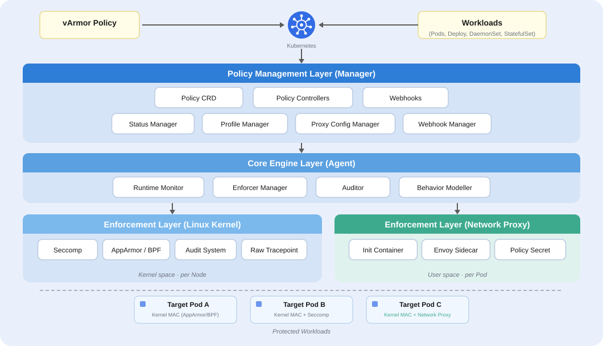

    <picture>
        <source media="(prefers-color-scheme: light)" srcset="docs/img/logo.svg" width="400">
        
    </picture>

 

[English](README.md) | [简体中文](README.zh_CN.md) | 日本語

vArmor は、クラウドネイティブなコンテナ堅牢化システムです。Linux の [AppArmor LSM](https://en.wikipedia.org/wiki/AppArmor)、[BPF LSM](https://docs.kernel.org/bpf/prog_lsm.html)、[Seccomp](https://en.wikipedia.org/wiki/Seccomp)、および [Envoy](https://www.envoyproxy.io/) ベースのサイドカーによる **NetworkProxy** をエンフォーサーとして使用します。コンテナの分離を強化し、カーネルの攻撃対象領域を縮小するとともに、TLS MITM による HTTPS 通信の復号・検査、HTTP ヘッダーの注入、ドメインフロンティング対策を含む L4/L7 の送信トラフィック制御を実現します。これにより、コンテナからの脱出やラテラルムーブメントの難易度とコストを高めることができます。Kubernetes クラスターでは、次のような場面でコンテナの保護に利用できます。

* マルチテナント環境で、コストや技術的な制約からハードウェア仮想化コンテナを利用できない場合。
* 重要な業務コンテナを堅牢化し、権限昇格、コンテナからの脱出、ラテラルムーブメントを困難にしたい場合。
* 高リスクの脆弱性を直ちに修正できず、脆弱性の種類や攻撃経路に応じて、その悪用を阻止したり難しくしたりしたい場合。
* AI Agent や LLM ベースのアプリケーションの送信トラフィックを細かく制御し、データの持ち出し、許可されていない API 呼び出し、プロンプトインジェクションに誘導されたツールの悪用を抑えたい場合。

**注意:**

* セキュリティ対策では、リスクと効果のバランスが重要です。適切なセキュリティ境界と防御技術を選ぶことで、制御できないリスクを管理可能なコストに変えられます。
* runc と vArmor の組み合わせは、Kata Containers などのハードウェア仮想化コンテナと同等の分離を提供するものではありません。より強い分離が必要な場合は、計算処理の分離にハードウェア仮想化コンテナを、ネットワークの分離に CNI の NetworkPolicy を検討してください。
* NetworkProxy は NetworkPolicy を補完し、HTTP/HTTPS の L7 アクセス制御（HTTPS には TLS MITM を使用）、TLS SNI に基づくドメインフィルタリング、ドメインごとの HTTP ヘッダー注入、ドメインフロンティング対策、監査ログを提供します。これらは Kubernetes の NetworkPolicy 自体にはない機能です。

**vArmor の主な機能:**

* **クラウドネイティブ**。Kubernetes Operator の設計パターンに従い、[CRD API](https://kubernetes.io/docs/concepts/extend-kubernetes/api-extension/custom-resources/) を通じて対象ワークロードを堅牢化します。業務上の要件に沿って、コンテナ化されたマイクロサービスを保護できます。
* **複数のエンフォーサー**。AppArmor、BPF、Seccomp、NetworkProxy を個別に、または組み合わせて使用できます。ファイルアクセス、プロセス実行、外部へのネットワーク通信（L3～L7）、システムコールなどを制御します。
* **NetworkProxy エンフォーサー**。Envoy サイドカーを使用してコンテナの送信トラフィックを透過的に捕捉し、L4（TCP）、L7（HTTP/HTTPS）、TLS SNI の各レベルで制御します。TLS MITM、ドメインごとの HTTP ヘッダー注入（API キーなど）、ドメインフロンティング対策、許可リストと拒否リスト、監査ログに対応します。ポリシーは Pod を再起動せずに更新できます。
* **AI Agent の保護**。カーネルレベルの強制アクセス制御（AppArmor/BPF/Seccomp）と、アプリケーションプロトコルレベルのネットワーク制御（NetworkProxy）を組み合わせます。プロンプトインジェクションによるツールの悪用、鍵情報の漏えい、許可されていないデータの持ち出しといったリスクを低減します。
* **デフォルト許可（Allow-by-Default）**。明示的に指定した動作だけを遮断するモデルを中心にサポートします。性能への影響を抑えながら導入でき、違反を監査しつつ許可することもできます。
* **組み込みルール**。デフォルト許可モデルで利用できるルールを用意しており、専門知識がなくても使い始められます。
* **動作モデリング（BehaviorModeling）**。ワークロードの動作を記録し、許可リスト型のポリシー作成、適用可能な組み込みルールの検討、最小権限に向けた設定の見直しに役立てられます。
* **デフォルト拒否（Deny-by-Default）**。許可リスト型のプロファイルを使ってワークロードを堅牢化し、ポリシーの作成と管理を支援します。

vArmor は ByteDance のエンドポイントセキュリティ部門に所属する **Elkeid Team** によって開発されており、現在も開発が続いています。

## アーキテクチャ

  

## ドキュメント

vArmor のドキュメントは [varmor.org](https://varmor.org) で公開しています。

AI Agent は[ドキュメント索引（llms.txt）](https://www.varmor.org/llms.txt)から言語とバージョンを選び、必要なページを参照できます。

⏩ **[クイックスタート](https://www.varmor.org/docs/main/introduction)**

⚙️ **[インストール](https://www.varmor.org/docs/main/getting_started/installation)**

📔 **[利用ガイド](https://www.varmor.org/docs/main/getting_started/usage_instructions)**

📜 **[ポリシーとルール](https://www.varmor.org/docs/main/guides/policies_and_rules)**

⏱️ **[パフォーマンス仕様](https://www.varmor.org/docs/main/guides/performance)**

## コントリビューション

vArmor への貢献をご検討いただき、ありがとうございます。参加するには、次のガイドをご覧ください。

🤝🏻 [行動規範](./CODE_OF_CONDUCT.md)を読み、遵守してください。

🛠️ [開発ガイド](https://www.varmor.org/docs/main/guides/development)をご覧ください。

💬 vArmor の [Lark グループ](https://applink.larkoffice.com/client/chat/chatter/add_by_link?link_token=ae5pfb2d-f8a4-4f0b-b12e-15f24fdaeb24&qr_code=true)に参加してください。

## ライセンス

vArmor プロジェクトには Apache License, Version 2.0 が適用されます。ただし、サードパーティーのコンポーネントには別のライセンスが適用される場合があります。詳細は各ソースファイルのライセンス表記をご確認ください。

vArmor を独自のプロジェクトに組み込む場合は、Apache 2.0 と、含まれるサードパーティーのコンポーネントに適用される各ライセンスを遵守してください。

eBPF コードは [vArmor-ebpf](https://github.com/bytedance/vArmor-ebpf) リポジトリにあり、GPL-2.0 ライセンスが適用されます。

## 謝辞

vArmor は eBPF プログラムの管理と操作に [cilium/ebpf](https://github.com/cilium/ebpf) を使用しています。

vArmor は [Nirmata](https://nirmata.com/) が開発した [kyverno](https://github.com/kyverno/kyverno) の一部実装を参考にしています。

## デモ

次のデモは、vArmor で Deployment を堅牢化し、CVE-2021-22555 を悪用した攻撃を防ぐ例です。使用したエクスプロイトは [cve-2021-22555](https://github.com/google/security-research/tree/master/pocs/linux/cve-2021-22555) を変更したものです。 

## 404Starlink

vArmor は [404Starlink](https://github.com/knownsec/404StarLink) に参加しています。
