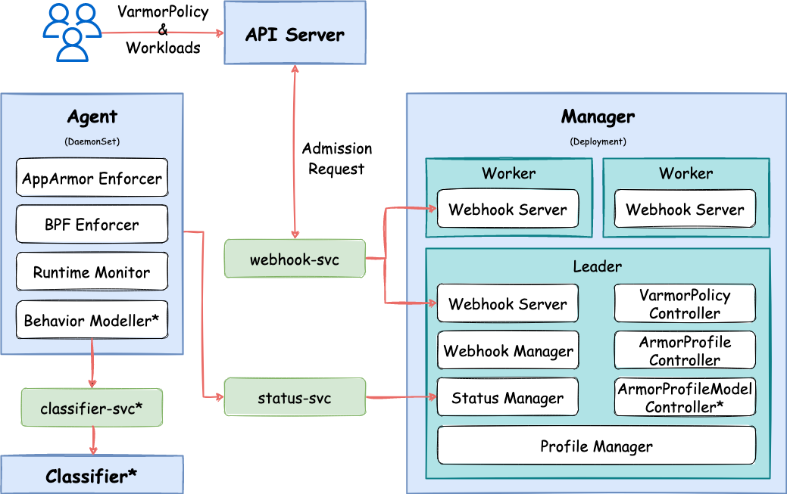

# vArmor: A Cloud Native Container Sandbox

English | [简体中文](README.zh_CN.md)

## Introduction

**vArmor** is a cloud-native container sandbox system that enhances container security with Linux's LSM technology. It utilizes either AppArmor or BPF LSM as enforcers. It can be used to strengthen container isolation, reduce the kernel attack surface, and increase the difficulty and cost of container escape or lateral movement attacks. **vArmor** follows the Kubernetes Operator design pattern, allowing users to harden specific workloads by manipulating the CRD API. This approach enables sandboxing of containerized microservices from a perspective closely aligned with business needs. Particularly, **vArmor** includes multiple built-in policies that are ready to use out of the box.

You can leverage **vArmor** in the following scenarios to provide sandbox protection for containers within a Kubernetes cluster:
* In multi-tenant environments, hardware-virtualized container solutions cannot be employed due to factors such as cost and technical conditions.
* When there is a need to enhance the security of critical business containers, making it more difficult for attackers to escalate privileges, escape, or laterally move.
* When high-risk vulnerabilities are present, but immediate remediation is not possible due to the difficulty or lengthy process of patching. **vArmor** can be used to mitigate the risks (depending on the vulnerability type or exploitation vector) to block or increase the difficulty of exploitation.


**vArmor** achieves cloud-native container sandboxing through the following technologies:
* Leveraging Linux's AppArmor or BPF LSM to enforce mandatory access controls on container processes (files, programs, network egress, etc.).
* To minimize performance impact and increase usability, **vArmor** follows an Allow by Default security model, where only explicitly declared behaviors are blocked.
* You can enhance the security of containers in specific workloads by manipulating the CRD API using built-in and custom policies.
* The built-in policies include common strategies for hardening containers.

**vArmor** was created by the **Elkeid Team** of the endpoint security department at ByteDance. And the project is still in active development.


*Note: To meet stringent isolation requirements, it is advisable to give priority to utilizing hardware-virtualized containers (e.g., Kata Containers) for compute isolation, in conjunction with network isolation provided by CNI's NetworkPolicy.*


## Architecture



## Prerequisites
|Enforcer|Requirements|Recommendations|
|------------|--------------------------------------------|--------|
|AppArmor    |1. Linux Kernel 4.15 and above<br>2. The AppArmor LSM is enabled|GKE with Container-Optimized OS<br>AKS with Ubuntu 22.04 LTS<br>[VKE](https://www.volcengine.com/product/vke) with veLinux<br>Debian 10 and above<br>Ubuntu 18.04.0 LTS and above<br>[veLinux](https://www.volcengine.com/docs/6396/74967) etc.
|BPF         |1. Linux Kernel 5.7 and above<br>2. containerd v1.6.0 and above<br>3. The BPF LSM is enabled|EKS with Amazon Linux 2<br>GKE with Container-Optimized OS<br>AKS with Ubuntu 22.04 LTS <sup>\*</sup><br>ACK with Alibaba Cloud Linux 3 <sup>\*</sup><br>OpenSUSE 15.4 <sup>\*</sup><br>Debian 11 <sup>\*</sup><br>Fedora 37 etc<br><br>* *Manual enabling of BPF LSM is required*


## The Built-in Policies

**vArmor** offers 5 types of built-in policies and custom interfaces to meet various protection requirements. Due to the differences between AppArmor LSM and BPF LSM, there are variations in the rules and syntax supported by different enforcers.

| Type                      | Description              |
|---------------------------|--------------------------|
| Always Allow              | No restrictions are imposed on the container during startup, and the policy settings can be changed later, allowing dynamic adjustment of protection policies without the need to restart the workload.|
| Runtime Default           | Basic protection is provided using the default policies that are the same as the container runtime components, but the level of protection is relatively weak. (For example, [cri-containerd.apparmor.d](https://github.com/containerd/containerd/blob/main/contrib/apparmor/template.go) in the containerd)|
| Hardening                 | The hardening rules for containers aims to reduce the attack surface and includes the following measures:<br>* Blocking common escape vectors for privileged containers<br>* Disabling specified capabilities<br>* Blocking exploitation vectors for certain kernel vulnerabilities.|
| Attack Protection         | The rules aims to protect against hacker penetration techniques, thereby increasing the difficulty and cost of attacks and enabling a defense-in-depth approach. It includes:<br>* Mitigating information leakage within containers<br>* Prohibiting the execution of sensitive actions<br>* Applying sandbox restrictions to specific executable files (AppArmor enforcer only)|
| Vulnerability Mitigation  | The rules is aimed at providing protection against vulnerabilities caused by insecure configurations, specific zero-day vulnerabilities, and security vulnerabilities caused by software features. It aims to block or increase the difficulty of vulnerability exploitation until the vulnerabilities are fixed.<br><br>(Note: This depends on the specific vulnerability type or exploit vector.)|


For specific details, please refer to the [Built-in Policies](docs/policy_manual.md#built-in-policies-wip) documentation. Please define your sandbox policies for workloads follow on the [System Interface](docs/usage_instructions.md#system-interface).

*Note: The built-in policies and syntax supported by different enforcers are still under development.*

## Quick start
### Step 1. Fetch chart
```
helm pull oci://elkeid-cn-beijing.cr.volces.com/varmor/varmor --version 0.5.2
```

### Step 2. Install
Some features of **vArmor** require configuration during installation. For more details, please refer to the [Configuration Options ](docs/usage_instructions.md).
```
kubectl create ns varmor
helm install varmor varmor-0.5.2.tgz \
    -n varmor \
    --set image.registry="elkeid-cn-beijing.cr.volces.com"
```

### Step 3. Try with this example
```
# Create a VarmorPolicy object to enable the AlwaysAllow mode sandbox for Deployments that match the .spec.target.selector
kubectl create -f test/demo/disable-shell/policy-init.yaml

# View the status of VarmorPolicy & ArmorProfile object
kubectl get VarmorPolicy -n demo
kubectl get ArmorProfile -n demo

# Create the target Deployment object
kubectl create -f test/demo/1/deploy.yaml

# Retrieve the Pod name of the target Deployment object
POD_NAME=$(kubectl get Pods -n demo -l app=demo-1 -o name)

# Execute a command in container c1 to read the secret token
kubectl exec -n demo $POD_NAME -c c1 -- cat /run/secrets/kubernetes.io/serviceaccount/token

# Update the VarmorPolicy object to prohibit the container c1 from reading the secret token.
kubectl apply -f test/demo/1/policy.yaml

# Execute a command in container c1 to read the secret token and verify that the reading behavior is prohibited.
kubectl exec -n demo $POD_NAME -c c1 -- cat /run/secrets/kubernetes.io/serviceaccount/token

# Delete the VarmorPolicy and Deployment objects
kubectl delete -f test/demo/disable-shell/policy-init.yaml
kubectl create -f test/demo/1/deploy.yaml
```

### Step 4. Uninstall
```
helm uninstall varmor -n varmor
```


## The Performance Specification
Please refer to this [documentation](docs/performance_specification.md).


## License

The vArmor project is licensed under Apache 2.0, except for third party components which are subject to different license terms. Please refer to the code header information in the code files.

Your integration of vArmor into your own projects should require compliance with the Apache 2.0 License, as well as the other licenses applicable to the third party components included within vArmor.

The eBPF code is located at [vArmor-ebpf](https://github.com/bytedance/vArmor-ebpf) and licensed under GPL-2.0.


## Credits
vArmor use [cilium/ebpf](https://github.com/cilium/ebpf) to manage and interact with the eBPF program.

vArmor references part of the code of [kyverno](https://github.com/kyverno/kyverno) developed by [Nirmata](https://nirmata.com/).


## Demo
Below is a demonstration of using vArmor to harden a Deployment and defend against CVE-2021-22555. (The exploit is modified from [cve-2021-22555](https://github.com/google/security-research/tree/master/pocs/linux/cve-2021-22555))<br>


## 404Starlink


vArmor has joined [404Starlink](https://github.com/knownsec/404StarLink)