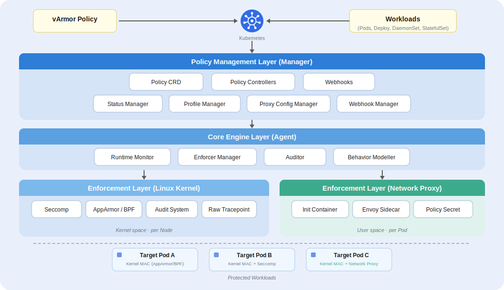

    <picture>
        <source media="(prefers-color-scheme: light)" srcset="docs/img/logo.svg" width="400">
        
    </picture>

 

[English](README.md) | 简体中文 | [日本語](README.ja.md)

vArmor 是一个云原生容器沙箱系统，它借助 Linux 的 [AppArmor LSM](https://en.wikipedia.org/wiki/AppArmor)、[BPF LSM](https://docs.kernel.org/bpf/prog_lsm.html)、[Seccomp](https://en.wikipedia.org/wiki/Seccomp) 以及**网络代理**（基于 [Envoy](https://www.envoyproxy.io/) 的 Sidecar）技术实现强制访问控制器（即 enforcer），从而对容器进行安全加固。它可以用于增强容器隔离性、减少内核攻击面、在 L4/L7 层级实施网络出站访问控制、增加容器逃逸或横向移动攻击的难度与成本。

您可以借助 vArmor 在以下场景对 Kubernetes 集群中的容器进行沙箱防护
* 业务场景存在多租户（多租户共享同一个集群），由于成本、技术条件等原因无法使用硬件虚拟化容器（如 Kata Container）
* 想要对关键的业务进行安全加固，增加攻击者权限提升、容器逃逸、横向渗透的难度与成本
* 当出现高危漏洞，但由于修复难度大、周期长等原因无法立即修复时，可以借助 vArmor 实施漏洞利用缓解（具体取决于漏洞类型或漏洞利用向量。缓解代表阻断利用向量、增加利用难度）
* 部署 AI Agent 或基于 LLM 的应用，需要精确控制其出站网络访问，防止数据外泄、未授权的 API 调用、或因提示词注入攻击导致的工具滥用

*注意：* 
* - 安全防御的核心在于平衡风险与收益，通过选择不同类型的安全边界和防御技术，将不可控风险转化为可控成本。*
* - runc + vArmor 不提供等同硬件虚拟化容器（如 Kata Container 等轻量级虚拟机）的隔离等级。如果您需要高强度的隔离方案，请优先考虑使用硬件虚拟化容器进行计算隔离，并借助 CNI 的 NetworkPolicy 进行网络隔离。*
* - vArmor 的 NetworkProxy enforcer 进一步补充了 NetworkPolicy 的不足，提供了 L7 访问控制、基于 TLS SNI 的域名过滤以及全面的审计日志能力——这些是 NetworkPolicy 所不具备的。*

**vArmor 的特色**
* **Cloud-Native**. vArmor 遵循 Kubernetes Operator 设计模式，用户可通过操作 [CRD API](https://kubernetes.io/docs/concepts/extend-kubernetes/api-extension/custom-resources/) 对特定的 Workloads 进行加固。从而以更贴近业务的视角，实现对容器化微服务的沙箱加固。
* **Multiple Enforcers**. vArmor 将 AppArmor、BPF、Seccomp、NetworkProxy 抽象为 Enforcer，并支持单独或组合使用，从而对容器的文件访问、进程执行、网络外联（L3–L7）、系统调用等进行访问控制。
* **Network Proxy Enforcer**. vArmor 引入了基于 Sidecar 代理（Envoy）的 enforcer，能够透明拦截并控制容器的网络出站流量，支持 L4（TCP）、L7（HTTP）和 TLS SNI 三个层级的访问控制。它同时支持黑名单和白名单两种策略模式，提供审计日志能力，且策略支持动态更新，无需重启 Pod。
* **AI Agent 防护**. vArmor 通过内核级强制访问控制（AppArmor/BPF/Seccomp）与应用协议级网络访问控制（NetworkProxy）的组合，为 AI Agent 工作负载提供纵深防御，有效缓解提示词注入诱导工具滥用、未授权数据外泄等风险。
* **Allow-by-Default**. vArmor 当前重点支持此安全模型，即只有显式声明的行为会被阻断，从而减少性能损失和增加易用性。vArmor 支持对违反访问控制规则的行为进行审计，并支持放行违反访问控制规则的行为。
* **Built-in Rules**. vArmor 提供了一系列开箱即用的内置规则。这些规则为 Allow-by-Default 安全模型设计，从而极大降低对用户专业知识的要求。
* **Behavior Modeling**. vArmor 支持对工作负载进行行为建模。这对于制定白名单安全策略、分析哪些内置规则可用于加固应用，或指导工作负载的配置以遵循最小权限原则非常有用。
* **Deny-by-Default**. vArmor 可以使用白名单安全策略来加固工作负载，并提供一种更便于用户使用的方式来开发和管理安全策略。

vArmor 由字节跳动终端安全团队的 **Elkeid Team** 研发，目前该项目仍在积极迭代中。

## 架构

  

## 文档
您可以访问 [varmor.org](https://varmor.org) 查看 vArmor 的文档。

👉 **[快速上手](https://www.varmor.org/docs/introduction#quick-start)**

👉 **[安装指引](https://www.varmor.org/docs/getting_started/installation)**

👉 **[使用手册](https://www.varmor.org/docs/getting_started/usage_instructions)**

👉 **[策略与规则](https://www.varmor.org/docs/guides/policies_and_rules)**

👉 **[性能说明](https://www.varmor.org/docs/guides/performance)**

## 贡献
感谢您有兴趣为 vArmor 做出贡献！以下是帮助您入门的一些步骤：

✔ 阅读并遵循社区[行为准则](./CODE_OF_CONDUCT.md).

✔ 阅读[开发指引](docs/development_guide.md).

✔ 加入 vArmor [飞书群](https://applink.larkoffice.com/client/chat/chatter/add_by_link?link_token=ae5pfb2d-f8a4-4f0b-b12e-15f24fdaeb24&qr_code=true).

## 许可证
vArmor 采用 Apache License, Version 2.0 许可证，受不同许可证约束的第三方组件除外。具体请参考代码文件中的代码头信息。

将 vArmor 集成到您自己的项目中应遵守 Apache 2.0 许可证以及适用于 vArmor 中包含的第三方组件的其他许可证。

vArmor 所使用的 eBPF 代码位于 [vArmor-ebpf](https://github.com/bytedance/vArmor-ebpf.git) 项目，并且使用 GPL-2.0 许可证。

## 致谢
vArmor 使用 [cilium/ebpf](https://github.com/cilium/ebpf) 来管理 eBPF 程序。

vArmor 在研发初期参考了 [Nirmata](https://nirmata.com/) 开发的 [kyverno](https://github.com/kyverno/kyverno) 的部分实现。 

## 演示
下面是一个使用 vArmor 对 Deployment 进行加固，防御 CVE-2021-22555 攻击的演示（Exploit 修改自 [cve-2021-22555](https://github.com/google/security-research/tree/master/pocs/linux/cve-2021-22555)）。 

## 404星链计划

vArmor 现已加入 [404星链计划](https://github.com/knownsec/404StarLink)