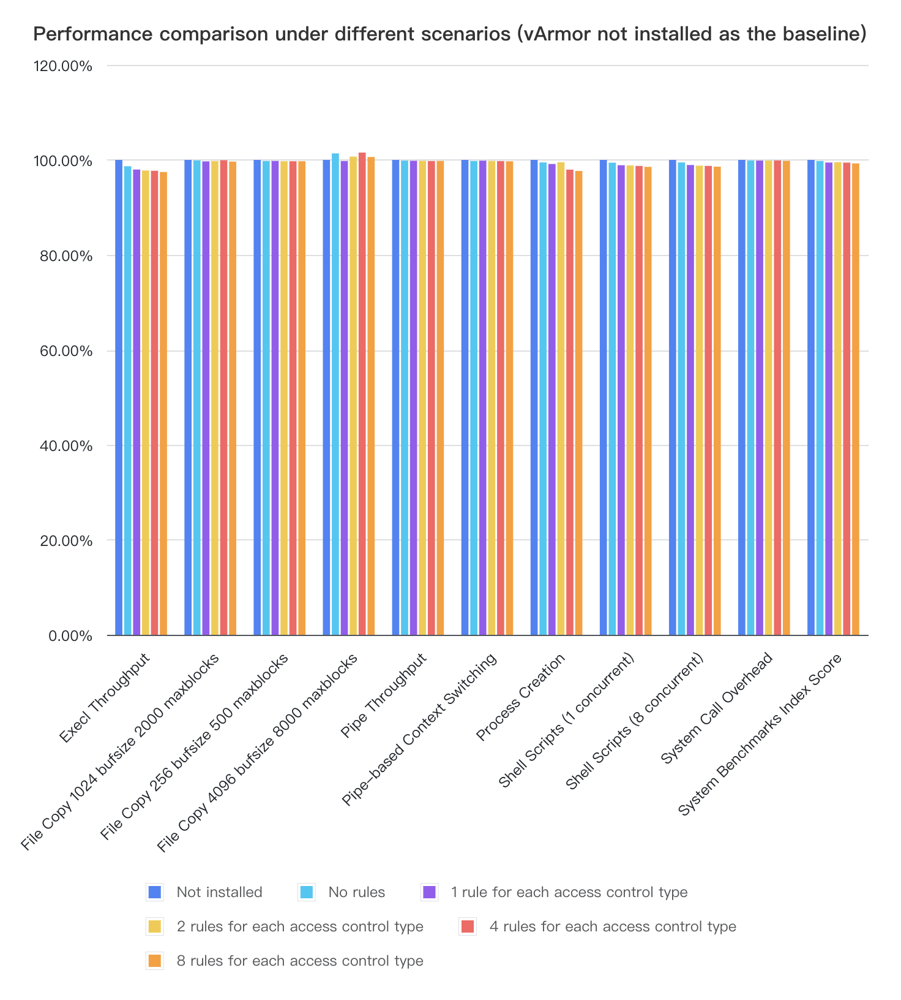

# The Performance Specification

English | [简体中文](performance_specification.zh_CN.md)

## Impact Factors

The factors affecting performance for vArmor's user-space and kernel-space components are as shown in the below

| Factor         | Explanation                                                                                                                                                                                                                                                             |
| -------------- | ----------------------------------------------------------------------------------------------------------------------------------------------------------------------------------------------------------------------------------------------------------------------- |
| Cluster scale  | As the cluster size increases, the CPU and memory consumed by the Manager for managing Agents also increase.                                                                                                                                                            |
| Resource scale | Creating a large number of VarmorPolicy CRs will result in increased CPU and memory consumption for Manager. Frequent creation/modification/deletion of VarmorPolicy CRs will result in increased CPU and memory consumption for both Manager and Agent in response. |
| AppArmor LSM   | The basic overhead introduced when the kernel enable the AppArmor LSM. The more rules in a profile, the greater the performance impact on processes.                                                                                                                 |
| BPF LSM        | The basic overhead introduced when the kernel enable the BPF LSM. The more rules in a profile, the greater the performance impact on processes.                                                                                                                      |

## Resource Usage

vArmor user-space components use the resource quotas as shown in the table below by default.

| Version | Manager CPU | Manager Memory | Agent CPU   | Agent Memory                                                                              |
| ------- |:-----------:|:--------------:|:-----------:|:-----------------------------------------------------------------------------------------:|
| v0.5.1  | 200m / 100m | 300Mi / 200Mi  | 200m / 100m | 100Mi / 40Mi (The BPF enforcer is disabled) 200Mi /100Mi (The BPF enforcer is enabled) |

Explanation:

* The default values are derived from experience and simulated test results (enabling protection for 400*32 Pods with one VarmorPolicy).
* You can set higher CPU and memory quotas for large-scale clusters by adjusting the values of helm chart during installation.
* When the BPF enforcer is enabled, the Agent requires more memory during startup

## Performance

### Benchmark Testing for BPF Enforcer

We conducted a basic performance test of BPF enforcer (v0.5.0) on a VKE cluster with kernel 5.10 using [byte-unixbench](https://github.com/kdlucas/byte-unixbench).

*Note: We plan to conduct further comparative testing for typical applications and scenarios in the future.*

Test environments:

* Kubernetes version: v1.20.15
* Node number: 2
* The node host has AppArmor and BPF LSM enabled by default.
* Node specification: ecs.g2i.xlarge (4 vCPUs, 16 GiB RAM)

Test steps:

* Deploy a test workload (disabling the default AppArmor profile for the test container via annotation).
* Perform 10 consecutive baseline tests within the test container.
* Install vArmor
* Perform 10 consecutive baseline tests within the test container
* Create a VarmorPolicy for the workload (1 rule for each access control type)， then perform 10 consecutive baseline tests within the test container.
* Update the VarmorPolicy (2 rules for each access control type), then perform 10 consecutive baseline tests within the test container.
* Update the VarmorPolicy (4 rules for each access control type), then perform 10 consecutive baseline tests within the test container.
* Update the VarmorPolicy (8 rules for each access control type), then perform 10 consecutive baseline tests within the test container.
* Collect test data, calculate the average of the test data, and then use the test results without vArmor installation as the baseline to measure performance losses under different scenarios.

Test results:

* After installing vArmor v0.5.0, if the container is not sandboxed (or if the container is sandboxed with the AlwaysAllow mode), it introduces a maximum performance loss of 1.34% to container process (in terms of Execl Throughput).

* vArmor v0.5.0 introduces the most significant performance overhead in terms of Execl Throughput and Process Creation. When 8 rules of various access control types are set for container process, the maximum performance loss for execl is 2.55%, and the maximum performance loss for process creation is 2.32%.

* The File Copy 4096 bufsize 8000 maxblocks scores for different test cases fluctuate compared to the baseline, which is unexpected. Possible reasons for this could be:
  
  * When the elastic cloud server is under high load, file copying may be accelerated due to factors like cache heat, leading to fluctuations.
  * The host may experience overselling, which can result in fluctuations in baseline test results within the elastic cloud server.
  
  

### Performance Testing of Simulated Real Scenarios and Common Loads

To further compare different Enforcers in real scenarios, we used the Phoronix Test Suite (PTS) to conduct a series of automated performance tests on some common loads (Redis, Apache, etc.).

#### Test Environment

- Cluster version: v1.26.10-vke.18
- Number of nodes: 3
- Nodes with AppArmor & BPF LSM enabled by default
- Node specifications: ecs.g3i.xlarge (4vCPU 16GiB)

#### Test Scenarios

In this round of testing, we performed horizontal comparisons of two enforcer LSMs: AppArmor and BPF LSM. Each enforcer was tested in three typical scenarios, including AlwaysAllow, RuntimeDefault, and the most protective EnhanceProtect. The policies for each scenario are as follows:

- **Init Test**
  - No policy applied
- **AlwaysAllow**
  - Tested with AlwaysAllow Mode, no rules enabled
- **RuntimeDefault**
  - Tested with RuntimeDefault Mode, no rules enabled
- **EnhanceProtect (most protective)**
  - Tested with EnhanceProtect Mode, with the following rules enabled:
    - disable-cap-privilege
    - disallow-umount
    - disallow-access-procfs-root
    - mitigate-disk-device-number-leak
    - mitigate-sa-leak
    - mitigate-overlayfs-leak
    - mitigate-host-ip-leak
    - disallow-metadata-service
    - cgroups-lxcfs-escape-mitigation
    - runc-override-mitigation

In addition, we also tested the Seccomp enforcer with the currently available four rules. This test is for reference only and not used as a performance benchmark.

The policy files used for the tests can be found in the test/perf/policy directory.

#### Test Process

We wrote a bash script to automate the testing process, which mainly completes the following tasks:

- Create and delete Pods in the Kubernetes cluster.
- Apply and remove different security policies.
- Initialize test configurations, install test tools, and run the Phoronix Test Suite.
- Record the test results.

Specifically, for the Init, BPF, and Seccomp modes, we used different Pod configurations and enabled `container.apparmor.security.beta.kubernetes.io/phoronix: unconfined` to ensure AppArmor was not enabled, avoiding the default AppArmor from affecting the test results.

You can find the pod definitions and Phoronix runtime configurations in the test/perf/policy directory. The automation test script is also located in the test/perf/policy directory. Additionally, we have written separate test scripts for sysbench and unixbench, which you can use if you are interested in conducting your own tests.

#### Test Results

1. **EnhanceProtect**:
   
   - The performance of BPF decreased by about 1.2% compared to AppArmor.

2. **RuntimeDefault**:
   
   - The performance of BPF decreased by about 0.6% compared to AppArmor.

3. **AlwaysAllow**:
   
   - The performance of BPF decreased by about 0.1% compared to AppArmor.

The analysis shows that although BPF generally exhibits slight performance degradation compared to AppArmor in different scenarios, the differences are relatively small. This indicates that BPF is a feasible alternative to AppArmor with acceptable performance overhead in security applications.

  

Below are the detailed test results for each scenario:

##### Phoronix-Apache

Requests Per Second-High is better

| Test Scenario           | Apache Concurrent Requests 4 | Apache Concurrent Requests 20 | Apache Concurrent Requests 100 | Apache Concurrent Requests 200 | Apache Concurrent Requests 500 | Apache Concurrent Requests 1000 |
| ----------------------- | ---------------------------- | ----------------------------- | ------------------------------ | ------------------------------ | ------------------------------ | ------------------------------- |
| NoProtect               | 16838.6                      | 17073.8                       | 16961.78                       | 16619.65                       | 14029.19                       | 11944.99                        |
| AlwaysAllow AppArmor    | 16469.41                     | 16505.84                      | 16764.14                       | 16312.69                       | 13750.24                       | 11729.78                        |
| AlwaysAllow BPF         | 16452.94                     | 16489.33                      | 16747.38                       | 16296.38                       | 13736.49                       | 11718.05                        |
| RuntimeDefault AppArmor | 16376.54                     | 16067.09                      | 16461.39                       | 16242.69                       | 13385.87                       | 11599.9                         |
| RuntimeDefault BPF      | 16360.16                     | 16051.02                      | 16444.93                       | 16226.45                       | 13372.48                       | 11588.3                         |
| Enhance AppArmor        | 15833.43                     | 15802.84                      | 16385.19                       | 16101.51                       | 13276.16                       | 11429.32                        |
| Enhance BPF             | 15817.6                      | 15787.04                      | 16368.8                        | 16085.41                       | 13262.88                       | 11417.89                        |
| Seccomp                 | 14882.43                     | 15035.12                      | 15454.24                       | 15312.25                       | 12870.28                       | 11162.86                        |

##### Phoronix-GIMP

Time Usage-Low is better

| Test Scenario           | GIMP Resize Times | GIMP RotateTimes | GIMP Auto-Levels Times | GIMP Unsharp-Mask Times |
| ----------------------- | ----------------- | ---------------- | ---------------------- | ----------------------- |
| NoProtect               | 16.616            | 11.842           | 16.543                 | 19.888                  |
| AlwaysAllow AppArmor    | 16.672            | 11.951           | 16.658                 | 20.04                   |
| AlwaysAllow BPF         | 16.872            | 12.094           | 16.858                 | 20.28                   |
| RuntimeDefault AppArmor | 16.737            | 11.977           | 16.734                 | 20.221                  |
| RuntimeDefault BPF      | 16.762            | 12.044           | 16.887                 | 20.289                  |
| Enhance AppArmor        | 16.855            | 11.958           | 16.814                 | 20.312                  |
| Enhance BPF             | 16.876            | 12.101           | 16.947                 | 20.411                  |
| Seccomp                 | 16.915            | 12.863           | 18.082                 | 21.096                  |

##### Phoronix-Redis

Requests Per Second-High is better

| Test Scenario           | GET Connection 50 | SETConnection 50 | GETConnection 500 | SET Connection 500 | LPOPConnection 500 |
| ----------------------- | ----------------- | ---------------- | ----------------- | ------------------ | ------------------ |
| NoProtect               | 2356517           | 1612305          | 1944514           | 1614023            | 2298349            |
| AlwaysAllow AppArmor    | 2336892           | 1610689          | 1936035           | 1605186            | 2287682            |
| AlwaysAllow BPF         | 2322870           | 1601025          | 1924418           | 1595555            | 2273956            |
| RuntimeDefault AppArmor | 2316004           | 1610480          | 1957586           | 1598156            | 2281477            |
| RuntimeDefault BPF      | 2302108           | 1600817          | 1945840           | 1588567            | 2267788            |
| Enhance AppArmor        | 2314458           | 1597515          | 1929528           | 1589630            | 2252763            |
| Enhance BPF             | 2300571           | 1587930          | 1917951           | 1580093            | 2239246            |
| Seccomp                 | 2280476           | 1596606          | 1875229           | 1547045            | 2316358            |

##### Phoronix-Sysbench

High is better

| Test Scenario           | SysbenchRam/Memory | SysbenchCPU |
| ----------------------- | ------------------ | ----------- |
| NoProtect               | 4189.51            | 2831.65     |
| AlwaysAllow AppArmor    | 4030.55            | 2821.5      |
| AlwaysAllow BPF         | 4026.519           | 2818.679    |
| RuntimeDefault AppArmor | 4023.67            | 2818.7      |
| RuntimeDefault BPF      | 4019.646           | 2815.881    |
| Enhance AppArmor        | 3939.25            | 2808.13     |
| Enhance BPF             | 3935.311           | 2805.322    |
| Seccomp                 | 4138.07            | 2832.87     |