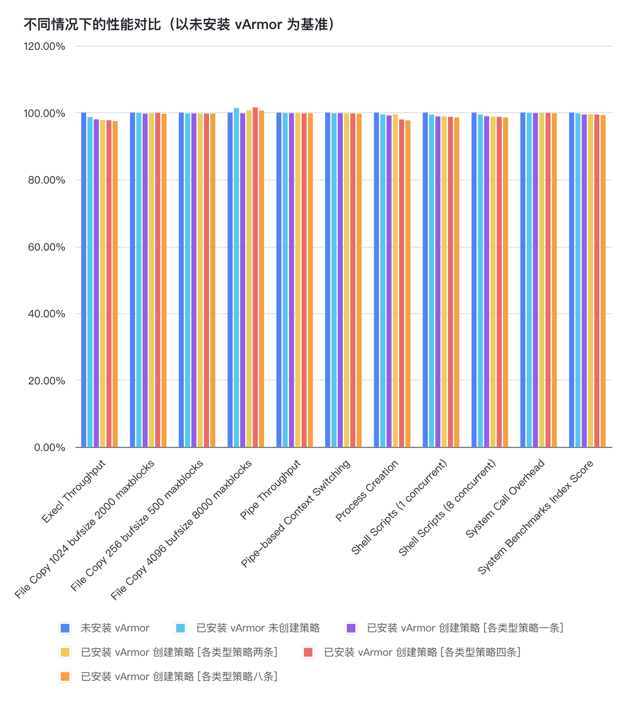

# The Performance Specification
## 影响因素
vArmor 的用户态组件和内核态组件对性能的影响因素如下表所示

|因素|说明|
|----|---|
|集群规模|集群规模越大，Manager 管理 Agent 所消耗的 CPU 和 内存越多
|VarmorPolicy 数量和操作频率|大量创建 VarmorPolicy CR 时，Manager 会消耗更多的 CPU 和内存进行响应 频繁创建/修改/删除 VarmorPolicy CR 时，Manager 和 Agent 会消耗更多的 CPU 和内存进行响应
|AppArmor LSM|开启 AppArmor LSM 为进程引入的基础开销 Profile 中的规则越多，对目标进程的性能影响越大
|BPF LSM|开启 BPF LSM 为进程引入的基础开销 Profile 中的规则越多，对目标进程的性能影响越大

## 资源占用
vArmor 用户态组件默认使用下表所示的值进行资源申请

|Version| Manager CPU | Manager Memory |  Agent CPU  | Agent Memory |
|-------|:-----------:|:--------------:|:-----------:|:------------:|
|v0.5.1 | 200m / 100m | 300Mi / 200Mi  | 200m / 100m | 100Mi / 40Mi (关闭 BPF enforcer 时) 200Mi /100Mi (开启 BPF enforcer 时)

说明：
* 默认值来自经验和模拟测试结果 (一个 VarmorPolicy 对 400*32 个Pods 开启防护)
* 你可以在安装组件时，通过调整 Helm Values 来为大规模集群设置更多的内存配额
* 若开启了 BPF enforcer，Agent 在启动并加载 BPF program 时需要更多的内存，因此内存资源的申请额度较高

## 性能影响
### AppArmor LSM
未做对比测试。可参考 19 年社区对 Linux AppArmor LSM 进行的性能测试 [Linux 5.5 Git Threadripper + No Apparmor](https://openbenchmarking.org/result/1912315-PTS-LINUX55G46)

### BPF LSM
我们利用 [byte-unixbench](https://github.com/kdlucas/byte-unixbench) 在安装了 veLinux with 5.10 kernel 的 VKE 集群中对 BPF enforcer (v0.5.0) 进行了初步的性能测试。

注：后续我们计划针对典型应用和场景，进行进一步对比测试

测试环境：
* 集群版本 v1.20.15-vke.10
* 节点数 2
* 节点主机默认启用 AppArmor & BPF LSM
* 节点规格 ecs.g2i.xlarge (4vCPU 16GiB)

测试步骤：
* 部署测试用的工作负载（通过 annotations 主动关闭测试容器的默认 AppArmor Profile）
* 在测试容器内连续执行 10 次基线测试
* 安装 vArmor
* 在测试容器内连续执行 10 次基线测试
* 为工作负载创建 VarmorPolicy（各类型策略各一条），在测试容器内连续执行 10 次基线测试
* 更新 VarmorPolicy（各类型策略各两条），在测试容器内连续执行 10 次基线测试
* 更新 VarmorPolicy（各类型策略各四条），在测试容器内连续执行 10 次基线测试
* 更新 VarmorPolicy（各类型策略各八条），在测试容器内连续执行 10 次基线测试
* 收集测试数据，对测试数据取均值，并以未安装 vArmor 时的测试结果为基准值，计算不同情况下的性能损失
  
测试结果：
* 安装 vArmor v0.5.0 后，若不对容器开启沙箱防护（或对容器开启 AlwaysAllow 模式沙箱）。将给容器进程引入最大 1.34% 的性能损失（Execl Throughput 维度）
* vArmor v0.5.0 在 Execl Throughput 和 Process Creation 中引入的性能损耗最大，当为容器进程设置各类型策略 8 条规则后，其 execl 的最大性能损耗为 2.55%，进程创建的最大性能损耗为 2.32%
* 不同测试用例的 File Copy 4096 bufsize 8000 maxblocks 得分与基准值相比有所波动，与预期不符。可能的原因是：
  * 当云主机在高负载时，cache 局部性/热度导致文件拷贝被加速等原因导致了波动
  * 云主机存在超售情况，宿主机在测试期间整体负载存在波动，从而导致云主机内的基线测试结果有所波动

  
  