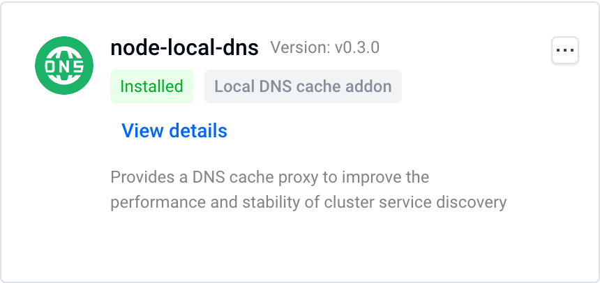
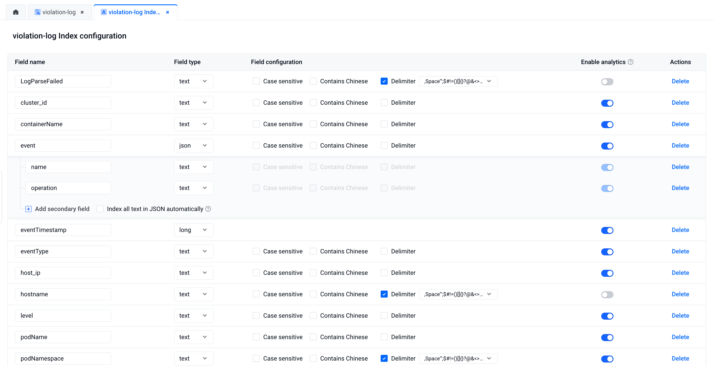
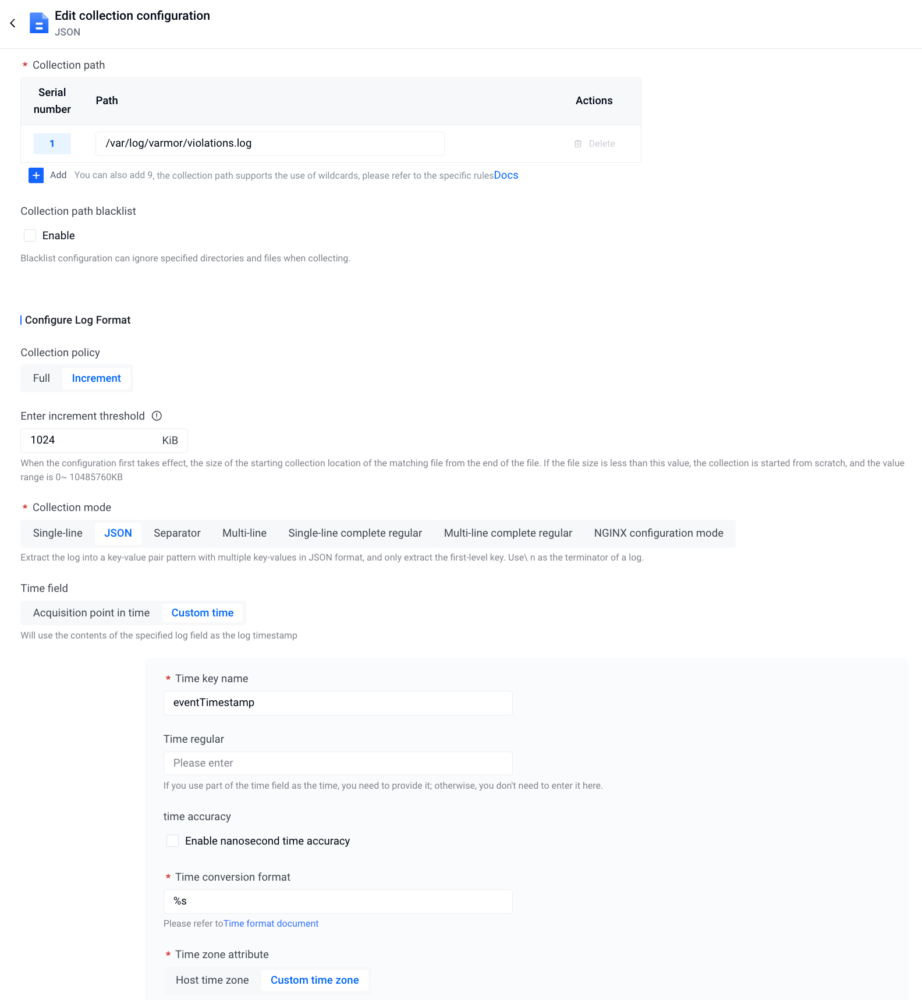
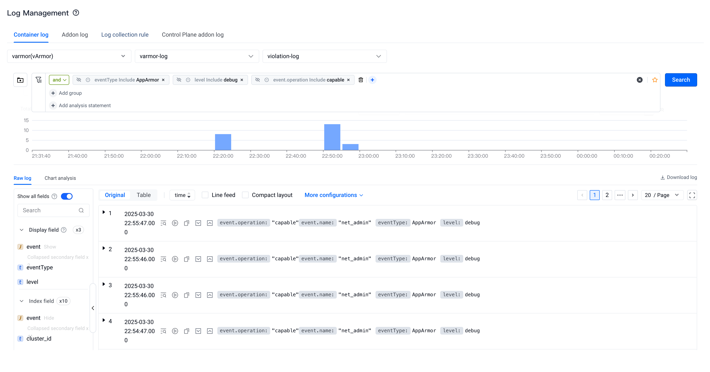
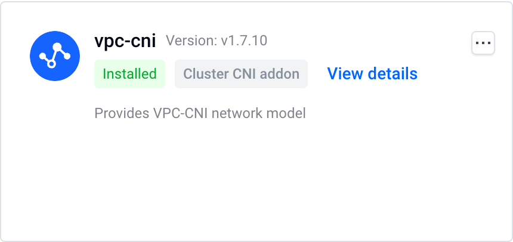

We briefly introduced the application scenarios of vArmor in the article "[application scenarios](https://varmor.org/docs/main/practices)". In terms of "hardening privileged container", when facing the challenge that it is difficult for enterprises to demote privileged containers in accordance with the principle of least privilege, we mentioned that the experimental feature of vArmor - the behavior modeling mode can be used to assist in demoting privileges.

This article will provide you with a detailed introduction to the necessity, challenges, and methods of removing privileged containers. It will also demonstrate through two use cases how to use the behavior modeling and observation mode features of vArmor to assist in demoting the privileges of privileged containers, thereby helping enterprises improve the security level of their cloud-native environments.

<!-- truncate -->

## Why Demote Privileged Containers

In a cloud-native environment, privileged containers usually refer to containers where `.spec.containers[].securityContext.privileged` is set to true in the Pod resource definition. These containers have the following main characteristics:

- Run as the root user & all capabilities.
- Have access to all devices on the host machine.
- The Seccomp Profile does not take effect, and there is a lack of AppArmor Profile protection.

Many research reports and cases have illustrated the hazards of using "privileged containers" <sup><a href="#ref1">[1]</a></sup><sup><a href="#ref2">[2]</a></sup>. Attackers can use it as a springboard and employ various techniques to launch attacks, ultimately spreading malicious code or malware to the infected host and network. Therefore, enterprises should try to limit the scope of use of privileged containers as much as possible and grant containers the necessary permissions based on the principle of least privilege.


:::tip[Note]
Reducing privileged containers in system components also has positive significance. In some scenarios, attackers may exploit the RCE vulnerabilities of system components to carry out penetration attacks. Removing the privileged containers can increase the difficulty and cost for attackers and help in the timely detection and response to attackers' intrusion behaviors.
:::

## The Challenges

- Due to historical reasons, enterprises may have already extensively used privileged containers. The services and components corresponding to the containers may already be in a maintenance state and no longer being iterated. The maintainers lack an understanding of the principles of the targets, and there is a relatively high risk in making changes to the configurations.
- Containerized system components often require some privileges to function properly. However, the permission management of modern operating systems and runc containers is complex and refined, making it difficult for developers to configure permissions in accordance with the principle of least privilege.
- There is a lack of tools and methods to help developers demote the privileges of privileged containers.

## Using vArmor to Assist in Privilege Demotion

### Applicable Scope
- Privileged containers in the following scenarios cannot be demoted:
  - The container uses the Bidirectional mount propagation property for volume mounting <sup><a href="#ref3">[3]</a></sup>.
- When using the AppArmor enforcer for behavior modeling, the cluster nodes need to support the AppArmor LSM. The confirmation method is as follows:
  ```bash
  cat /sys/kernel/security/lsm | grep apparmor
  ```

### Method Description

#### 1. Assisting in Privilege Demotion with the Behavior Modeling Mode

The [BehaviorModeling Mode](https://www.varmor.org/docs/main/guides/policies_and_rules/policy_modes/behavior_modeling) is an experimental feature of vArmor. Users can create VarmorPolicy or VarmorClusterPolicy policy objects in the BehaviorModeling mode to perform behavior modeling on the containers of the target application within a specified duration. After the modeling is completed, vArmor will save the behavior data of the target application in an ArmorProfileModel object, as well as the AppArmor or Seccomp security profiles generated based on it.

The behavior data can help security and development personnel analyze which capabilities (such as the net_admin capability) the target application needs during its operation, which system files it reads and writes (such as /proc/sys/kernel/printk_ratelimit), etc. By combining the differences between privileged and non-privileged containers and configuring the necessary permissions for the containers based on the principle of least privilege, the privilege demotion can be achieved.


#### 2. Assisting in Privilege Demotion with the Observation Mode

When using VarmorPolicy or VarmorClusterPolicy policy objects in the EnhanceProtect mode to harden containers, you can also enable the observation mode by configuring `auditViolations: true` and `allowViolations: true` simultaneously. In this way, all behaviors that violate the security rules will be recorded in vArmor's [audit log](https://varmor.org/docs/main/getting_started/usage_instructions#audit-logs).

We can utilize this feature, in conjunction with the [`disable-cap-privileged`](https://www.varmor.org/docs/main/guides/policies_and_rules/built_in_rules/hardening#disable-cap-privileged) or [`disable-cap-all`](https://www.varmor.org/docs/main/guides/policies_and_rules/built_in_rules/hardening#disable-cap-all) built-in rules, to monitor and collect which capabilities the target application needs to use during its operation. Then, the collected data can be used to configure the necessary permissions for the container, thereby achieving privilege demotion.


### Precautions

#### Pay Attention to the Differences between Privileged and Non-Privileged Containers
There are some differences in how container runtime components (such as containerd, cri-o, dockerd) handle "privileged containers" and "non-privileged containers". Therefore, when running components using "non-privileged containers", additional configurations may be required to ensure that the components can operate properly.

* **Default capabilities**

  To improve compatibility, container runtime components will by default grant some capabilities to non-privileged containers <sup><a href="#ref4">[4]</a></sup>. For example, containerd will grant the following capabilities to non-privileged containers by default. Capabilities other than these need to be added through `securityContext.capabilities.add`.

  ```
  AUDIT_WRITE
  CHOWN
  DAC_OVERRIDE
  FOWNER
  FSETID
  KILL
  MKNOD
  NET_BIND_SERVICE
  SETFCAP
  SETGID
  SETPCAP
  SETUID
  SYS_CHROOT
  ```

* **Default AppArmor Profile**

  When the operating system enables the AppArmor LSM, the container runtime components will automatically configure a default AppArmor Profile for "non-privileged containers" <sup><a href="#ref5">[5]</a></sup><sup><a href="#ref6">[6]</a></sup>. Although the configuration granularity of the default AppArmor Profile is relatively coarse, it will disable mount operations and prohibit writing to some system files.

  ```
    deny @{PROC}/* w,   # deny write for all files directly in /proc (not in a subdir)
    # deny write to files not in /proc/<number>/** or /proc/sys/**
    deny @{PROC}/{[^1-9],[^1-9][^0-9],[^1-9s][^0-9y][^0-9s],[^1-9][^0-9][^0-9][^0-9]*}/** w,
    deny @{PROC}/sys/[^k]** w,  # deny /proc/sys except /proc/sys/k* (effectively /proc/sys/kernel)
    deny @{PROC}/sys/kernel/{?,??,[^s][^h][^m]**} w,  # deny everything except shm* in /proc/sys/kernel/
    deny @{PROC}/sysrq-trigger rwklx,
    deny @{PROC}/mem rwklx,
    deny @{PROC}/kmem rwklx,
    deny @{PROC}/kcore rwklx,

    deny mount,

    deny /sys/[^f]*/** wklx,
    deny /sys/f[^s]*/** wklx,
    deny /sys/fs/[^c]*/** wklx,
    deny /sys/fs/c[^g]*/** wklx,
    deny /sys/fs/cg[^r]*/** wklx,
    deny /sys/firmware/** rwklx,
    deny /sys/devices/virtual/powercap/** rwklx,
    deny /sys/kernel/security/** rwklx,
  ```

  Therefore, when your container depends on mount operations or needs to write to the above-mentioned system files, you need to explicitly disable the AppArmor Profile through the following configuration to avoid having its operations blocked by the default AppArmor Profile.

  ```yaml
  # Applicable to Kubernetes versions below v1.30
  metadata:
    annotations:
      container.apparmor.security.beta.varmor.org/CONTAINER_NAME: unconfined
    
  # Applicable to Kubernetes versions v1.30 and above
  spec：
    containers:
    - securityContext:
        appArmorProfile:
          type: Unconfined
  ```

* **Default maskedPaths & readonlyPaths**

  Container runtime components that comply with the OCI standard will by default set some files and directories within the proc file system of non-privileged containers to masked (unreadable) and read-only modes, thereby isolating them from the host machine <sup><a href="#ref7">[7]</a></sup>. The file list is as follows:

  - Masked Paths
    ```
    /proc/asound
    /proc/acpi
    /proc/kcore
    /proc/keys
    /proc/latency_stats
    /proc/timer_list
    /proc/timer_stats
    /proc/sched_debug
    /proc/scsi
    /sys/firmware
    /sys/devices/virtual/powercap
    ```

  - Read-Only Paths

    ```
    /proc/bus
    /proc/fs
    /proc/irq
    /proc/sys
    /proc/sysrq-trigger
    ```

  If your system components need to read and write the above files, you can bypass the restrictions through the following methods (choose one of the two):
  * Use procMount in securityContext (requires enabling the ProcMountType feature of Kubernetes)
  * Explicitly mount the host procfs into the container

#### Collect Data as Much as Possible

Whether using the behavior modeling mode to collect the behavior data of the target application or using the observation mode to collect the violation behaviors of the target application, the completeness depends on whether the target application triggers all the program functions that require privileges during the analysis process. Therefore, when you are not confident in the results, we recommend that you collect more data by running as many test cases as possible, extending the analysis duration, etc., to ensure that the required capabilities and system file read and write behaviors are identified.


#### Combine Multiple Methods

You can also combine Method 1 and Method 2, and use methods such as the application's own logs and code auditing for comprehensive analysis.

## Use cases

This section will take the VKE Addon of Volcano Engine as an example to demonstrate how to use vArmor to assist in demoting the privileges of privileged containers. (VKE, the full name of Volcengine Kubernetes Engine, is an enterprise-level container cloud management platform based on Kubernetes provided by ByteDance's Volcano Engine).

Note that all examples are self-tested by the author of this article. They may be incomplete due to the lack of test cases, so they are for reference only.


### Preparation

#### Install vArmor

```bash
helm install varmor varmor-0.7.0.tgz  \
    --namespace varmor --create-namespace \
    --set image.registry="elkeid-cn-beijing.cr.volces.com" \
    --set image.namespace="varmor" \
    --set behaviorModeling.enabled=true \
    --set 'manager.args={--webhookMatchLabel=}'
```

* `--set behaviorModeling.enabled=true` enables the behavior modeling feature.
* `--set 'manager.args={--webhookMatchLabel=}'` sets the workload matching label of the vArmor webhook to empty, ensuring that no additional labels need to be added to the target workload. For details, see [Setting the match label of webhook](https://varmor.org/docs/main/getting_started/installation#set-the-match-label-of-webhook).

#### Collect the List of Privileged Containers (Optional)

Use the following command to list the Pods that have privileged containers and whose containers do not use the Bidirectional type of mountPropagation.

```bash
kubectl get pods -A -o json | jq -r '
  .items[] |
  select(
    any(
      .spec.containers[]?;
      .securityContext?.privileged == true and
      (
        (.volumeMounts // []) |
        all( .mountPropagation? != "Bidirectional" )
      )
    )
  ) |
  "\(.metadata.namespace)/\(.metadata.name)"
'
```

### The node-local-dns Component



The [node-local-dns](https://docs.byteplus.com/en/docs/vke/Using-NodeLocal-DNSCache) component has a DaemonSet named node-local-dns, which contains a privileged container named node-cache. We will use the behavior modeling and observation mode features of vArmor to assist in demoting the privileges.

#### Assisting in Privilege Demotion with the Behavior Modeling Function

1. Create a policy object

    ```yaml
    apiVersion: crd.varmor.org/v1beta1
    kind: VarmorPolicy
    metadata:
      name: node-local-dns-policy
      namespace: kube-system
    spec:
      # Perform a rolling update on existing workloads.
      # It's disabled by default.
      updateExistingWorkloads: true
      target:
        kind: DaemonSet
        name: node-local-dns
        containers:
        - node-cache
      policy:
        enforcer: AppArmor
        mode: BehaviorModeling
        modelingOptions:
          # 30 minutes
          duration: 30
    ```

    This policy will use the AppArmor enforcer to perform behavior modeling on the node-cache container in the node-local-dns DaemonSet in the kube-system namespace. The modeling duration is 30 minutes. As shown below, after the policy object is created, it will automatically perform a rolling update on node-local-dns and start the modeling.

    ```bash
    $ kubectl create -f node-local-dns-policy.yaml
    varmorpolicy.crd.varmor.org/node-local-dns-policy created

    $ kubectl get Pods -n kube-system | grep node-local-dns
    node-local-dns-admission-79847997cc-5wtzp               1/1     Running                    0               18d
    node-local-dns-admission-79847997cc-6dwln               1/1     Running                    0               18d
    node-local-dns-k6ct8                                    1/1     Running                    0               5s
    node-local-dns-psdn6                                    1/1     Terminating                0               3s
    node-local-dns-z744q                                    1/1     Running                    0               1s
    ```

2. During the behavior modeling, create a test Pod, and then use the method in Reference <sup><a href="#ref8">[8]</a></sup> to verify whether the node-local-dns component is working properly.

3. Modify the modeling duration to 1m, end the behavior modeling early, and wait for the modeling to complete

    ```bash
    $ kubectl patch vpol -n kube-system node-local-dns-policy --type='json' -p='[{"op": "replace", "path": "/spec/policy/modelingOptions/duration", "value":1}]'
    varmorpolicy.crd.varmor.org/node-local-dns-policy patched

    $ kubectl get vpol -n kube-system node-local-dns-policy
    NAME                    ENFORCER   MODE               TARGET-KIND   TARGET-NAME      TARGET-SELECTOR   PROFILE-NAME                               READY   STATUS      AGE
    node-local-dns-policy   AppArmor   BehaviorModeling   DaemonSet     node-local-dns                     varmor-kube-system-node-local-dns-policy   true    Completed   5m23s
    ```

4. View the ArmorProfileModel object

    ```bash
    $ name=$(kubectl get vpol -n kube-system node-local-dns-policy -o jsonpath='{.status.profileName}')
    $ kubectl get ArmorProfileModel -n kube-system $name -o wide
    NAME                                       STORAGE-TYPE   DESIRED   COMPLETED   READY   AGE
    varmor-kube-system-node-local-dns-policy   CRDInternal    3         3           true    3m17s
    ```

5. Export the behavior data and the AppArmor Profile respectively

    ```bash
    $ kubectl get ArmorProfileModel -n kube-system $name -o jsonpath='{.data.dynamicResult.apparmor}' | jq > behavior_data.json

    $ kubectl get ArmorProfileModel -n kube-system $name -o jsonpath='{.data.profile.content}' > apparmor_profile.txt
    ```

    Note: When the STORAGE-TYPE is LocalDisk, please refer to [this method](https://varmor.org/docs/main/guides/policies_and_rules/policy_modes/behavior_modeling#data-export) to export the data.

6. Analyze the capabilities and system file access behaviors required by the node-cache container based on the above exported data.

    By analyzing the content of the behavior_data.txt file, we draw the following conclusions:

    - Its behavior does not violate the default AppArmor Profile of the container runtime component <sup><a href="#ref5">[5]</a></sup><sup><a href="#ref6">[6]</a></sup>.
    - Its behavior does not conflict with the maskedPaths and readonlyPaths settings of non-privileged containers.
    - It requires two capabilities, net_admin and net_bind_service. Among them, net_bind_service is a capability that is defaultly granted by the container runtime, and net_admin is a dropped capability.

    ```
    ## == Managed by vArmor == ##

    abi <abi/3.0>,
    #include <tunables/global>

    profile varmor-kube-system-node-local-dns-policy flags=(attach_disconnected,mediate_deleted) {

      #include <abstractions/base>

      # ---- EXEC ----
      /bin/grep ix,
      /bin/ln ix,
      /bin/rm ix,
      /usr/bin/wc ix,
      /usr/sbin/iptables-wrapper ix,
      /usr/sbin/xtables-nft-multi ix,

      # ---- FILE ----
      owner /bin/dash r,
      owner /bin/grep r,
      owner /bin/ln r,
      owner /bin/rm r,
      owner /dev/null rww,
      owner /etc/Corefile rw,
      owner /etc/coredns/ r,
      owner /etc/coredns/* r,
      owner /etc/coredns/*/Corefile.base r,
      owner /etc/kube-dns/ r,
      owner /etc/kube-dns/* r,
      owner /etc/nsswitch.conf r,
      owner /etc/passwd r,
      owner /etc/protocols r,
      owner /lib/x86_64-linux-gnu/** mr,
      owner /node-cache r,
      owner /proc/*/cgroup r,
      owner /proc/*/fd/ r,
      owner /proc/*/limits r,
      owner /proc/*/net/ip6_tables_names r,
      owner /proc/*/net/ip_tables_names r,
      owner /proc/*/stat r,
      owner /proc/stat r,
      owner /proc/sys/net/core/somaxconn r,
      owner /sys/kernel/mm/transparent_hugepage/hpage_pmd_size r,
      owner /usr/bin/wc r,
      owner /usr/lib/x86_64-linux-gnu/** mr,
      owner /usr/sbin/ip6tables w,
      owner /usr/sbin/ip6tables-restore w,
      owner /usr/sbin/ip6tables-save w,
      owner /usr/sbin/iptables w,
      owner /usr/sbin/iptables-restore w,
      owner /usr/sbin/iptables-save w,
      owner /usr/sbin/iptables-wrapper r,
      owner /usr/sbin/xtables-nft-multi r,

      # ---- CAPABILITY ----
      capability net_admin,
      capability net_bind_service,

      # ---- NETWORK ----
      network,

      # ---- PTRACE ----
      ## suppress ptrace denials when using 'docker ps' or using 'ps' inside a container
      ptrace (trace,read,tracedby,readby) peer=varmor-kube-system-node-local-dns-policy,

      # ---- SIGNAL ----
      ## host (privileged) processes may send signals to container processes.
      signal (receive) peer=unconfined,
      ## container processes may send signals amongst themselves.
      signal (send,receive) peer=varmor-kube-system-node-local-dns-policy,

      # ---- ADDITIONAL ----
      umount,

    }
    ```

7. Delete the policy object

    ```bash
    $ kubectl delete vpol -n kube-system node-local-dns-policy
    ```

8. Modify the node-local-dns DaemonSet to demote the privileges

    As shown below, remove `privileged: true` from `.spec.template.spec.containers[0].securityContext`, and then add the net_admin capability.

    ```yaml
    securityContext:
      capabilities:
        add:
        - net_admin
    ```

9. After the node-local-dns is restarted, determine whether there are any abnormalities by checking the container status and logs. Then repeat step 2 to analyze whether the node-local-dns component is working properly. If everything is normal, it means that the privilege demotion is successful.

#### Assisting in Privilege Demotion with the Observation Mode

1. Create a topic for collecting audit logs in the torch log service of BytePlus, and configure the following index

    

2. Configure the log collection rules in the VKE cluster to collect audit logs from the host (the log path is /var/log/varmor/violations.log)

    

3. Create a policy object

    ```yaml
    apiVersion: crd.varmor.org/v1beta1
    kind: VarmorPolicy
    metadata:
      name: node-local-dns-policy
      namespace: kube-system
    spec:
      # Perform a rolling update on existing workloads.
      # It's disabled by default.
      updateExistingWorkloads: true
      target:
        kind: DaemonSet
        name: node-local-dns
        containers:
        - node-cache
      policy:
        enforcer: AppArmor
        mode: EnhanceProtect
        enhanceProtect:
          # Audit the actions that violate the mandatory access control rules.
          # Any detected violation will be logged to /var/log/varmor/violations.log file in the host.
          # It's disabled by default.
          auditViolations: true
          # Allow the actions that violate the mandatory access control rules.
          # Any detected violation will be allowed instead of being blocked and logged to the same log file 
          # as the auditViolations feature. You can utilize the feature to achieve some kind of observation mode.
          # It's diabled by default.
          allowViolations: true
          hardeningRules:
          - disable-cap-privileged
    ```

    This policy uses the AppArmor enforcer to perform "access control" on the node-cache container in the node-local-dns DaemonSet. The policy configures the [disable-cap-privileged](https://www.varmor.org/docs/main/guides/policies_and_rules/built_in_rules/hardening/#disable-cap-privileged) built-in rule (you can also configure it as the [disable-cap-all](https://www.varmor.org/docs/main/guides/policies_and_rules/built_in_rules/hardening/#disable-cap-all) built-in rule), and enables the observation mode through the `auditViolations: true` and `allowViolations: true` options. Therefore, when the application in the container uses capabilities other than defaultUnixCaps <sup><a href="#ref9">[9]</a></sup>, its violation behavior will be recorded in the audit log.

    After the policy object is created, it will automatically perform a rolling update on the node-local-dns DaemonSet, thereby starting the monitoring.

    ```bash
    $ kubectl create -f node-local-dns-policy.yaml
    varmorpolicy.crd.varmor.org/node-local-dns-policy created

    $ kubectl get Pods -n kube-system -o wide | grep node-local-dns
    node-local-dns-2pfx6                                    0/1     ContainerCreating          0               1s     172.31.0.22    172.31.0.22               <none>           <none>
    node-local-dns-admission-79847997cc-5wtzp               1/1     Running                    0               18d    172.31.0.81    172.31.0.22               <none>           <none>
    node-local-dns-admission-79847997cc-6dwln               1/1     Running                    0               18d    172.31.0.15    172.31.0.21               <none>           <none>
    node-local-dns-njzmh                                    1/1     Running                    0               10h    172.31.0.21    172.31.0.21               <none>           <none>
    node-local-dns-q2scn                                    1/1     Running                    0               2s     172.31.0.20    172.31.0.20               <none>           <none>
    ```

4. Create a test Pod, and then use the method in Reference <sup><a href="#ref8">[8]</a></sup> to verify whether the node-local-dns component is working properly.

5. Use the following filtering conditions to collect which capabilities the node-local-dns needs during its operation.

    

6. Delete the policy object after the observation is completed.

7. Modify the node-local-dns DaemonSet to demote the privileges

    As shown below, we remove `privileged: true` from `.spec.template.spec.containers[0].securityContext`, and then add the net_admin capability.

    ```yaml
    securityContext:
      capabilities:
        add:
        - net_admin
    ```

8. After the node-local-dns is restarted, determine whether there are any abnormalities by checking the container status and logs. Then repeat step 4 to analyze whether the node-local-dns component is working properly. If everything is normal, it means that the privilege demotion is successful.
node-local-dns.

#### Conclusion

We have successfully used vArmor to demote the privileges of the node-local-dns DaemonSet in the node-local-dns component, reducing it from a privileged container to a container that only requires the net_admin capability.

### The vpc-cni Component



The [vpc-cni](https://docs.byteplus.com/en/docs/vke/vpc-cni) component has a DaemonSet named cello, which contains two privileged containers - cello and cilium. The latter is used to implement functions related to NetworkPolicy. We refer to the steps in Use Case 1 and use the behavior modeling function to demote the privileges of the two containers.

#### The cello Container

1. Export the behavior model data and analyze the capabilities and system file access behaviors required by the cello container. It is found that its behavior does not violate the default AppArmor Profile of the container runtime component <sup><a href="#ref5">[5]</a></sup><sup><a href="#ref6">[6]</a></sup>, and it only requires two capabilities, net_admin and sys_admin.

    ```
    ## == Managed by vArmor == ##

    abi <abi/3.0>,
    #include <tunables/global>

    profile varmor-kube-system-cello-policy flags=(attach_disconnected,mediate_deleted) {

      #include <abstractions/base>

      # ---- EXEC ----

      # ---- FILE ----
      owner / r,
      owner /cello/bin/cello-agent r,
      owner /cello/secrets/*/addon_token_info r,
      owner /etc/cello/cello-config r,
      owner /etc/hosts r,
      owner /etc/nsswitch.conf r,
      owner /etc/resolv.conf r,
      owner /proc/*/cgroup r,
      owner /proc/*/mountinfo r,
      owner /proc/*/net/ipv6_route r,
      owner /proc/*/net/route r,
      owner /proc/sys/net/core/somaxconn r,
      owner /run/cello/Resource.db krw,
      owner /run/cello/cello_debug.socket w,
      owner /run/cello/cni.socket w,
      owner /run/netns/ r,
      owner /run/netns/* r,
      owner /run/secrets/kubernetes.io/serviceaccount/** r,
      owner /sys/fs/cgroup/cpu,cpuacct/cpu.cfs_period_us r,
      owner /sys/fs/cgroup/cpu,cpuacct/cpu.cfs_quota_us r,
      owner /sys/kernel/mm/transparent_hugepage/hpage_pmd_size r,
      owner /usr/share/zoneinfo/Asia/Shanghai r,
      owner /var/lib/kubelet/device-plugins/eni-ip.sock w,

      # ---- CAPABILITY ----
      capability net_admin,
      capability sys_admin,

      # ---- NETWORK ----
      network,

      # ---- PTRACE ----
      ## suppress ptrace denials when using 'docker ps' or using 'ps' inside a container
      ptrace (trace,read,tracedby,readby) peer=varmor-kube-system-cello-policy,

      # ---- SIGNAL ----
      ## host (privileged) processes may send signals to container processes.
      signal (receive) peer=unconfined,
      ## container processes may send signals amongst themselves.
      signal (send,receive) peer=varmor-kube-system-cello-policy,

      # ---- ADDITIONAL ----
      umount,

    }
    ```

2. Based on the above conclusions, modify the cello container in the cello DaemonSet to demote the privileges. The main modification contents are as follows:

    ```yaml
    securityContext:
      capabilities:
        add:
        - net_admin
        - sys_admin
    ```

3. After the cello is restarted, determine whether there are any abnormalities by checking the container status and logs. Then use other test cases to verify whether the cello container can work properly. If everything is normal, it means that the privilege demotion is successful.


#### The Cilium Container

1. Export the behavior model data and analyze the capabilities and system file access behaviors required by the cilium container, and draw the following conclusions:

    - It requires capabilities such as bpf, chown, fsetid, net_admin, net_raw, perfmon, sys_admin, sys_module, sys_nice, sys_resource, and syslog.
    - Its behavior violates the following rules in the default AppArmor Profile of the container runtime component <sup><a href="#ref5">[5]</a></sup><sup><a href="#ref6">[6]</a></sup>:
      ```
      deny @{PROC}/sys/kernel/{?,??,[^s][^h][^m]**} w,  # deny everything except shm* in /proc/sys/kernel/
      deny /sys/[^f]*/** wklx,
      deny /sys/fs/[^c]*/** wklx,
      ```
    - Its behavior conflicts with /proc/timer_list in the maskedPaths of non-privileged containers.
    - Its behavior conflicts with /proc/sys in the readonlyPaths of non-privileged containers.

      ```
      ## == Managed by vArmor == ##

      abi <abi/3.0>,
      #include <tunables/global>

      profile varmor-kube-system-cilium-policy flags=(attach_disconnected,mediate_deleted) {

        #include <abstractions/base>

        # ---- EXEC ----
        /usr/bin/cat ix,
        /usr/bin/cilium-agent ix,
        /usr/bin/cilium-map-migrate ix,
        /usr/bin/cilium-operator-generic ix,
        /usr/bin/cilium-probe-kernel-hz ix,
        /usr/bin/clang ix,
        /usr/bin/grep ix,
        /usr/bin/llc ix,
        /usr/bin/ln ix,
        /usr/bin/mawk ix,
        /usr/bin/rm ix,
        /usr/bin/sed ix,
        /usr/bin/wc ix,
        /usr/local/bin/bpftool ix,
        /usr/local/bin/ip ix,
        /usr/local/bin/tc ix,
        /usr/sbin/iptables-wrapper ix,
        /usr/sbin/xtables-nft-multi ix,
        /var/lib/cilium/bpf/init.sh ix,

        # ---- FILE ----
        owner /cello/bin/cilium-launcher r,
        owner /dev/null rww,
        owner /dev/tty rw,
        owner /dev/urandom r,
        owner /etc/cilium/cello-config r,
        owner /etc/cilium/cilium-config/ r,
        owner /etc/cilium/cilium-config/* r,
        owner /etc/cilium/cilium-config/*/debug r,
        owner /etc/cilium/cilium-config/*/enable-policy r,
        owner /etc/group r,
        owner /etc/hosts r,
        owner /etc/ld.so.cache r,
        owner /etc/lsb-release r,
        owner /etc/nsswitch.conf r,
        owner /etc/passwd r,
        owner /etc/protocols r,
        owner /etc/resolv.conf r,
        owner /proc/*/fdinfo/* r,
        owner /proc/*/mountinfo r,
        owner /proc/*/net/ip6_tables_names r,
        owner /proc/*/net/ip_tables_names r,
        owner /proc/*/net/psched r,
        owner /proc/filesystems r,
        owner /proc/meminfo r,
        owner /proc/modules r,
        owner /proc/stat r,
        owner /proc/sys/kernel/timer_migration rw,
        owner /proc/sys/kernel/unprivileged_bpf_disabled rw,
        owner /proc/sys/net/core/bpf_jit_enable rw,
        owner /proc/sys/net/core/bpf_jit_harden r,
        owner /proc/sys/net/core/bpf_jit_kallsyms r,
        owner /proc/sys/net/core/bpf_jit_limit r,
        owner /proc/sys/net/core/default_qdisc rw,
        owner /proc/sys/net/core/netdev_max_backlog r,
        owner /proc/sys/net/core/somaxconn r,
        owner /proc/sys/net/ipv4/conf/all/forwarding rw,
        owner /proc/sys/net/ipv4/conf/all/rp_filter rw,
        owner /proc/sys/net/ipv4/conf/cilium_host/accept_local rw,
        owner /proc/sys/net/ipv4/conf/cilium_host/forwarding rw,
        owner /proc/sys/net/ipv4/conf/cilium_host/rp_filter rw,
        owner /proc/sys/net/ipv4/conf/cilium_host/send_redirects rw,
        owner /proc/sys/net/ipv4/conf/eth0/rp_filter rw,
        owner /proc/sys/net/ipv4/ip_forward rw,
        owner /proc/sys/net/ipv4/ip_local_port_range r,
        owner /proc/sys/net/ipv4/tcp_congestion_control rw,
        owner /proc/sys/net/ipv4/tcp_max_syn_backlog r,
        owner /proc/timer_list r,
        owner /root/.config/ w,
        owner /root/.config/gops/ w,
        owner /root/.config/gops/* w,
        owner /run/cilium/* r,
        owner /run/cilium/access_log.sock w,
        owner /run/cilium/cilium.pid w,
        owner /run/cilium/cilium.sock w,
        owner /run/cilium/health.sock w,
        owner /run/cilium/monitor1_2.sock w,
        owner /run/cilium/state/ r,
        owner /run/cilium/state/** rw,
        owner /run/cilium/xds.sock w,
        owner /run/secrets/kubernetes.io/serviceaccount/** r,
        owner /sys/devices/system/cpu/possible r,
        owner /sys/devices/virtual/net/cilium_host/ifindex r,
        owner /sys/fs/bpf/ r,
        owner /sys/fs/bpf/tc/globals/ r,
        owner /sys/fs/bpf/tc/globals/cilium_capture_cache w,
        owner /sys/fs/bpf/tc/globals/cilium_cgroups_connect4 w,
        owner /sys/fs/bpf/tc/globals/cilium_cgroups_connect6 w,
        owner /sys/fs/bpf/tc/globals/cilium_cgroups_getpeername4 w,
        owner /sys/fs/bpf/tc/globals/cilium_cgroups_getpeername6 w,
        owner /sys/fs/bpf/tc/globals/cilium_cgroups_post_bind4 w,
        owner /sys/fs/bpf/tc/globals/cilium_cgroups_post_bind6 w,
        owner /sys/fs/bpf/tc/globals/cilium_cgroups_recvmsg4 w,
        owner /sys/fs/bpf/tc/globals/cilium_cgroups_recvmsg6 w,
        owner /sys/fs/bpf/tc/globals/cilium_cgroups_sendmsg4 w,
        owner /sys/fs/bpf/tc/globals/cilium_cgroups_sendmsg6 w,
        owner /sys/fs/bpf/tc/globals/cilium_ipcache w,
        owner /sys/fs/bpf/tc/globals/cilium_ktime_cache w,
        owner /sys/fs/bpf/tc/globals/cilium_tunnel_map w,
        owner /sys/kernel/mm/transparent_hugepage/hpage_pmd_size r,
        owner /usr/bin/bash r,
        owner /usr/bin/cat r,
        owner /usr/bin/cilium-agent mr,
        owner /usr/bin/cilium-map-migrate r,
        owner /usr/bin/cilium-operator-generic mr,
        owner /usr/bin/cilium-probe-kernel-hz r,
        owner /usr/bin/clang r,
        owner /usr/bin/dash r,
        owner /usr/bin/grep r,
        owner /usr/bin/llc r,
        owner /usr/bin/ln r,
        owner /usr/bin/mawk r,
        owner /usr/bin/rm r,
        owner /usr/bin/sed r,
        owner /usr/bin/wc r,
        owner /usr/lib/x86_64-linux-gnu/** mr,
        owner /usr/local/bin/* r,
        owner /usr/local/bin/ip r,
        owner /usr/local/bin/tc r,
        owner /usr/sbin/ip6tables w,
        owner /usr/sbin/ip6tables-restore w,
        owner /usr/sbin/ip6tables-save w,
        owner /usr/sbin/iptables w,
        owner /usr/sbin/iptables-restore w,
        owner /usr/sbin/iptables-save w,
        owner /usr/sbin/iptables-wrapper r,
        owner /usr/sbin/xtables-nft-multi r,
        owner /usr/share/zoneinfo/Asia/Shanghai r,
        owner /var/lib/cilium/ r,
        owner /var/lib/cilium/bpf/ r,
        owner /var/lib/cilium/bpf/** r,

        # ---- CAPABILITY ----
        capability bpf,
        capability chown,
        capability fsetid,
        capability net_admin,
        capability net_raw,
        capability perfmon,
        capability sys_admin,
        capability sys_module,
        capability sys_nice,
        capability sys_resource,
        capability syslog,

        # ---- NETWORK ----
        network,

        # ---- PTRACE ----
        ## suppress ptrace denials when using 'docker ps' or using 'ps' inside a container
        ptrace (trace,read,tracedby,readby) peer=varmor-kube-system-cilium-policy,

        # ---- SIGNAL ----
        ## host (privileged) processes may send signals to container processes.
        signal (receive) peer=unconfined,
        ## container processes may send signals amongst themselves.
        signal (send,receive) peer=varmor-kube-system-cilium-policy,

        # ---- ADDITIONAL ----
        umount,

      }
      ```

2. Based on the above conclusions, modify the cilium container in the cello DaemonSet to demote the privileges. The modification contents are as follows:

    - Prohibit the container runtime component from setting its default AppArmor Profile for the cello container by adding `container.apparmor.security.beta.varmor.org/cilium: unconfined` or `.spec.template.spec.containers[1].securityContext.appArmorProfile.type: Unconfined`
    - Add the required capabilities.
    - Explicitly mount the host procfs into the container.

    ```yaml
    apiVersion: apps/v1
    kind: DaemonSet
    metadata:
      annotations:
        deprecated.daemonset.template.generation: "8"
        meta.helm.sh/release-name: vpc-cni
        meta.helm.sh/release-namespace: kube-system
        webhook.varmor.org/mutatedAt: "2025-03-12T03:15:59Z"
      creationTimestamp: "2024-07-18T08:51:32Z"
      generation: 8
      labels:
        addon.vke.volcengine.com/status-check: vpc-cni
        app: cello
        app.kubernetes.io/managed-by: Helm
        sandbox.varmor.org/enable: "true"
      name: cello
      namespace: kube-system
      resourceVersion: "191600885"
      uid: 3d22f651-93cc-4344-a844-f8e5dc3bede7
    spec:
      revisionHistoryLimit: 10
      selector:
        matchLabels:
          app: cello
      template:
        metadata:
          annotations:
            container.apparmor.security.beta.varmor.org/cilium: unconfined
          labels:
            addon.vke.volcengine.com/status-check: vpc-cni
            app: cello
        spec:
          affinity:
            nodeAffinity:
              requiredDuringSchedulingIgnoredDuringExecution:
                nodeSelectorTerms:
                - matchExpressions:
                  - key: kubernetes.io/os
                    operator: In
                    values:
                    - linux
                  - key: kubernetes.io/arch
                    operator: In
                    values:
                    - amd64
                    - arm64
                  - key: type
                    operator: NotIn
                    values:
                    - virtual-kubelet
                  - key: node.kubernetes.io/instance-type
                    operator: NotIn
                    values:
                    - dcp-node
                  - key: node.vke.volcengine.com/deletion
                    operator: NotIn
                    values:
                    - "true"
          containers:
          - command:
            - cello-agent
            env:
            - name: KUBERNETES_SERVICE_HOST
              value: 172.31.0.2
            - name: KUBERNETES_SERVICE_PORT
              value: "6443"
            - name: NODE_NAME
              valueFrom:
                fieldRef:
                  apiVersion: v1
                  fieldPath: spec.nodeName
            image: vke-cn-shanghai.cr.volces.com/vke/cello:v1.7.10
            imagePullPolicy: IfNotPresent
            livenessProbe:
              failureThreshold: 6
              httpGet:
                path: /healthz
                port: 11414
                scheme: HTTP
              initialDelaySeconds: 30
              periodSeconds: 10
              successThreshold: 1
              timeoutSeconds: 1
            name: cello
            readinessProbe:
              failureThreshold: 12
              httpGet:
                path: /healthz
                port: 11414
                scheme: HTTP
              initialDelaySeconds: 10
              periodSeconds: 10
              successThreshold: 1
              timeoutSeconds: 1
            resources:
              limits:
                cpu: 250m
                memory: 256Mi
              requests:
                cpu: 100m
                memory: 100Mi
            securityContext:
              privileged: true
            terminationMessagePath: /dev/termination-log
            terminationMessagePolicy: File
            volumeMounts:
            - mountPath: /var/run/cello
              name: host-run-cello
            - mountPath: /var/run/cilium
              name: host-cilium-run
            - mountPath: /var/run/netns
              mountPropagation: HostToContainer
              name: host-run-netns
            - mountPath: /opt/cni/bin
              name: host-cni-bin-dir
            - mountPath: /var/log/cello
              name: host-log-cello
            - mountPath: /var/log/cello/cni.log
              name: host-log-cello-cni
            - mountPath: /var/lib/kubelet/device-plugins
              name: host-device-plugins
            - mountPath: /etc/cello/cello-config
              name: configvolume
              subPath: cello.json
            - mountPath: /cello/secrets
              name: credential
          - command:
            - cilium-launcher
            env:
            - name: KUBERNETES_SERVICE_HOST
              value: 172.31.0.2
            - name: KUBERNETES_SERVICE_PORT
              value: "6443"
            - name: KUBE_PROXY_REPLACEMENT
              value: strict
            - name: NODENAME
              valueFrom:
                fieldRef:
                  apiVersion: v1
                  fieldPath: spec.nodeName
            - name: K8S_NODE_NAME
              valueFrom:
                fieldRef:
                  apiVersion: v1
                  fieldPath: spec.nodeName
            - name: CILIUM_K8S_NAMESPACE
              valueFrom:
                fieldRef:
                  apiVersion: v1
                  fieldPath: metadata.namespace
            - name: CILIUM_CNI_CHAINING_MODE
              value: cello-chainer
            image: vke-cn-shanghai.cr.volces.com/vke/cello:v1.7.10
            imagePullPolicy: IfNotPresent
            livenessProbe:
              failureThreshold: 6
              initialDelaySeconds: 30
              periodSeconds: 10
              successThreshold: 1
              tcpSocket:
                host: localhost
                port: 9099
              timeoutSeconds: 1
            name: cilium
            readinessProbe:
              failureThreshold: 3
              periodSeconds: 10
              successThreshold: 1
              tcpSocket:
                host: localhost
                port: 9099
              timeoutSeconds: 1
            resources:
              requests:
                cpu: 250m
                memory: 256Mi
            securityContext:
              capabilities:
                add:
                - bpf
                - chown
                - fsetid
                - net_admin
                - net_raw
                - perfmon
                - sys_admin
                - sys_module
                - sys_nice
                - sys_resource
                - syslog
            terminationMessagePath: /dev/termination-log
            terminationMessagePolicy: File
            volumeMounts:
            - mountPath: /lib/modules
              name: host-lib-modules
            - mountPath: /etc/cni/net.d
              name: host-cni-conf-dir
            - mountPath: /opt/cni/bin/
              name: host-cni-bin-dir
            - mountPath: /sys/fs/bpf
              name: host-bpf-maps
            - mountPath: /var/run/cilium
              name: host-cilium-run
            - mountPath: /var/run/netns
              name: host-run-netns
            - mountPath: /run/xtables.lock
              name: host-xtables-lock
            - mountPath: /etc/cilium/cilium-config
              name: cilium-config-path
              readOnly: true
            - mountPath: /etc/cilium/cello-config
              name: configvolume
              subPath: cello.json
            - mountPath: /proc
              name: procfs
          dnsPolicy: ClusterFirst
          hostNetwork: true
          hostPID: true
          initContainers:
          - command:
            - /bin/bash
            - -c
            - /script/install_env.sh
            image: vke-cn-shanghai.cr.volces.com/vke/cello:v1.7.10
            imagePullPolicy: IfNotPresent
            name: cello-init
            resources: {}
            securityContext:
              privileged: true
            terminationMessagePath: /dev/termination-log
            terminationMessagePolicy: File
            volumeMounts:
            - mountPath: /opt/cni/bin/
              name: host-cni-bin-dir
            - mountPath: /etc/cni/net.d/
              name: host-cni-conf-dir
            - mountPath: /lib/modules
              name: host-lib-modules
            - mountPath: /etc/cello
              name: configvolume
          priorityClassName: system-node-critical
          restartPolicy: Always
          schedulerName: default-scheduler
          securityContext: {}
          serviceAccount: cello-service-account
          serviceAccountName: cello-service-account
          terminationGracePeriodSeconds: 30
          tolerations:
          - operator: Exists
          volumes:
          - configMap:
              defaultMode: 420
              items:
              - key: conf
                path: cello.json
              - key: 10-cello.conflist
                path: net.d/10-cello.conflist
              - key: 01-cello-meta.conflist
                path: net.d/01-cello-meta.conflist
              name: cello-config
            name: configvolume
          - configMap:
              defaultMode: 420
              name: cilium-config
            name: cilium-config-path
          - hostPath:
              path: /opt/cni/bin/
              type: DirectoryOrCreate
            name: host-cni-bin-dir
          - hostPath:
              path: /etc/cni/net.d/
              type: DirectoryOrCreate
            name: host-cni-conf-dir
          - hostPath:
              path: /var/run/cello
              type: DirectoryOrCreate
            name: host-run-cello
          - hostPath:
              path: /var/run/netns
              type: DirectoryOrCreate
            name: host-run-netns
          - hostPath:
              path: /var/log/cello
              type: DirectoryOrCreate
            name: host-log-cello
          - hostPath:
              path: /var/log/cello/cni.log
              type: FileOrCreate
            name: host-log-cello-cni
          - hostPath:
              path: /var/lib/kubelet/device-plugins
              type: Directory
            name: host-device-plugins
          - hostPath:
              path: /lib/modules
              type: ""
            name: host-lib-modules
          - hostPath:
              path: /var/run/cilium
              type: DirectoryOrCreate
            name: host-cilium-run
          - hostPath:
              path: /sys/fs/bpf
              type: DirectoryOrCreate
            name: host-bpf-maps
          - hostPath:
              path: /run/xtables.lock
              type: FileOrCreate
            name: host-xtables-lock
          - hostPath:
              path: /proc
              type: Directory
            name: procfs
          - name: credential
            secret:
              defaultMode: 420
              optional: true
              secretName: addon.network.token
      updateStrategy:
        rollingUpdate:
          maxSurge: 0
          maxUnavailable: 1
        type: RollingUpdate

    ```

3. After the cello is restarted, determine whether there are any abnormalities by checking the container status and logs. Then verify whether the cilium container can work properly by creating test cases such as a NetworkPolicy object. If everything is normal, it means that the privilege demotion is successful.

#### Conclusion

We have successfully used vArmor to demote the privileges of the cello container and the cilium container in the vpc-cni component. The vpc-cni uses technologies such as bpf to implement CNI functions. Although it requires many capabilities to function, removing the privileged containers from the component still has positive significance.

## Summary

The permission management of modern operating systems and runc containers is complex and refined. Developers often lack the knowledge and tools to configure the minimum necessary permissions for containers, which is the main reason why it is difficult to converge a large number of privileged containers.

This article, combined with two use cases, introduced the method of using vArmor to assist in privilege demotion and related precautions. We hope that the many features of vArmor can help you continuously improve the security level of your cloud-native environment.

## References

1. [Why A Privileged Container in Docker Is a Bad Idea](https://www.trendmicro.com/en_us/research/19/l/why-running-a-privileged-container-in-docker-is-a-bad-idea.html)<a id="ref1"/>
2. [Why Running a Privileged Container is Not a Good Idea](https://cloudnativenow.com/topics/cloudnativesecurity/why-running-a-privileged-container-is-not-a-good-idea/)<a id="ref2"/>
3. [Mount Propagation](https://docs.redhat.com/en/documentation/openshift_container_platform/3.11/html/configuring_clusters/persistent-storage-examples#mount-propagation-overview)<a id="ref3"/>
4. [Pod Security Standards](https://kubernetes.io/docs/concepts/security/pod-security-standards/)<a id="ref4"/>
5. https://github.com/containerd/containerd/blob/main/contrib/apparmor/template.go<a id="ref5"/>
6. https://github.com/containers/common/blob/main/pkg/apparmor/apparmor_linux_template.go<a id="ref6"/>
7. [Managing access to the /proc filesystem](https://kubernetes.io/docs/tasks/configure-pod-container/security-context/#proc-access)<a id="ref7"/>
8. [How do I confirm that the node-local-dns add-on is used](https://docs.byteplus.com/en/docs/vke/How-do-I-confirm-that-the-node-local-dns-add-on-is-used)<a id="ref8"/>
9. https://github.com/containerd/containerd/blob/main/pkg/oci/spec.go#L118<a id="ref9"/>
