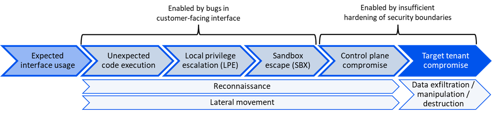

import ThemeImage from '@site/src/components/ThemeImage';

# Application Practices

## Introduction

This article will introduce the purpose of the vArmor project and then introduce its applications in scenarios such as multi-tenant isolation, core business hardening, privileged container hardening, and network egress control (AI Agent hardening) from a technical perspective. This article will show you how to solve specific problems by relying on the technical features of vArmor, to achieve technical and business goals and help enterprises build a solid security defense line in a cloud-native environment.

## Why vArmor Was Launched

Container runtime components and Kubernetes have added support for LSM and Seccomp. Seccomp became generally available in Kubernetes v1.19, and AppArmor LSM became generally available in Kubernetes v1.30. Users can write and manage AppArmor, SELinux, and Seccomp profiles on their own and configure security policies in workloads' specification for hardening. Almost all container runtime components come with a default AppArmor profile and Seccomp profile. However, the default Seccomp profile needs to be explicitly set to be enabled for containers, and the default AppArmor profile requires operating system support to be enabled for containers automatically.

Fully leveraging the security mechanisms of the Linux system can effectively harden containers. For example, technologies such as LSM and Seccomp can be used to enforce mandatory access control on container processes, reducing the kernel attack surface and increasing the difficulty and cost of container escape or lateral movement attacks. Their basic principles are shown in the following figure.

<ThemeImage 
  lightSrc="/img/lsm.svg" 
  darkSrc="/img/lsm-dark.svg" 
  alt="lsm" 
/>
<br /><br />

However, writing and managing security profiles face numerous challenges:
* The default profiles of container runtime components have limitations. They cannot defend against some certain vulnerabilities, misconfiguration risks, nor can they restrict attackers' penetration behavior within containers.
* Building AppArmor, Seccomp, or SELinux profiles requires expertise.
* Developing robust security profiles, especially those in the Deny-by-Default mode, for complex and rapidly evolving containerized applications is difficult.
* AppArmor or SELinux LSM depends on the operating system distribution, thus having limitations.
* In a Kubernetes environment, automating the management and application of different security profiles is complex.

To address these issues, vArmor emerged. It provides multiple policy modes, built-in rules, and configuration options. According to the definition of policy objects, vArmor manages security profiles (AppArmor Profile, BPF Profile, Seccomp Profile) to harden containers for different workloads. In addition, vArmor provides the NetworkProxy enforcer based on an Envoy Sidecar, which can enforce access control on containers' network egress traffic at the L4/L7 layers. vArmor also implements behavior modeling functions based on BPF and Audit technologies, which can collect behaviors of different applications and generate behavior models to assist in building security policies.

For example, users can configure policy objects according to their needs to achieve three effects: interception only, interception with alarm, and alarm only. They can also use built-in rules and custom rules to update policy objects to meet the requirements of different application scenarios. Next, we will use several application scenarios to show how vArmor helps enterprises enhance container security capabilities in the cloud-native environment.

## vArmor's Application Scenarios

### Multi-tenant Isolation

#### Risks of Multi-tenant Applications

Most modern SaaS applications adopt a multi-tenant mode. Severe vulnerabilities and the corresponding exploitation chains are highly likely to enable malicious users to access the data of other tenants. With the advent of the era of large language models, the usage volume of cloud services will further increase. Therefore, those who build such services need to pay more attention to the risks of multi-tenant isolation and take preventive measures to reduce the risk of cross-tenant attacks.  

The following is a typical vulnerability-enabled cross-tenant attack sequence depicted by Wiz in the PEACH framework<sup><a href="#ref1">[1]</a></sup>.




Numerous cases show that the root causes of cross-tenant vulnerabilities and exploit chains mainly include:
* The user interface has a relatively high complexity, and harmless bugs and features in the interface exacerbate the risks.
* The implementation of multi-tenant shared components is improper.
* The security boundaries of multi-tenant exclusive components are improperly implemented.

To address these issues, the following mitigation measures can be taken:
* Reduce the complexity of the user interface.
* Transform shared components into tenant-exclusive components.
* Enhance the isolation of tenant-exclusive components.

#### How to Choose a Hardening Solution

Wiz pointed out in the PEACH framework that for multi-tenant applications, the tenant isolation technology solution should be selected based on the results of security modeling, taking into account factors such as compliance, data sensitivity, and cost. Enterprises should convert uncontrollable risks into controllable costs by choosing different types of security boundaries and defense technologies.

Tenant isolation is used to compensate for the multi-tenant isolation security risks brought about by the complexity of the interface. The complexity of the interface is positively correlated with the probability of vulnerabilities. The following table describes a simple method for evaluating interface complexity<sup><a href="#ref1">[1]</a></sup>.

| **Interface type** | **Typical input (example)** | **Typical process** | **Complexity level** 
|--|--|--|--|
| Arbitrary code execution environment | Arbitrary | Execution | High |
| Database client | SQL query | Database operation | High |
| Arbitrary file scanner | Arbitrary | Parsing | Medium |
| Binary data parsing | Protobuf | Parsing | Medium |
| Web crawler | JavaScript | Rendering | Medium |
| Port scanner | Metadata | Parsing | Low |
| Reverse proxy | Arbitrary | Proxy | Low |
| Queue message upload | Arbitrary | Proxy | Low |
| Data entry form | String | Parsing | Low |
| Bucket file upload | Arbitrary | Storage | Low |

For complex interfaces, such as components that support tenants to execute arbitrary code, it is recommended to choose a high isolation-level security boundary (such as containers based on lightweight virtual machine technology) to ensure the security of tenant data. For less complex tenant scenarios and interfaces, such as file scanner, data parsing, web page rendering, file upload, etc., technical solutions such as vArmor can be considered for hardening.

#### What Else Needs to Be Done

Since the isolation level of runc + vArmor is lower than that of hardware-virtualized containers (such as lightweight virtual machine containers like Kata Container), it cannot defend against all container escape vulnerabilities. Therefore, when using vArmor to harden multi-tenant applications, it is necessary to assume that advanced attackers may use vulnerabilities to escape to the host. 

We recommend that you cooperate with the following security practices to increase the difficulty and cost of further attacks after an attacker escapes, and detect attack behaviors in a timely manner.

* Tenant workloads should meet the Baseline or Restricted standards of the Pod Security Standard<sup><a href="#ref2">[2]</a></sup> and implement network micro-segmentation using technologies such as NetworkPolicy.
* Develop reasonable scheduling strategies to avoid scheduling different tenant workloads to the same node.
* Different tenants should use exclusive namespaces. Tenant workloads should be granted limited Kubernetes RBAC and IAM permissions based on the principle of least privilege, avoiding the grant of sensitive permissions. The list of sensitive Kubernetes RBAC permissions can refer to the whitepaper<sup><a href="#ref3">[3]</a></sup> published by Palo Alto Networks.
* Develop reasonable scheduling strategies to schedule system component workloads with sensitive Kubernetes RBAC and IAM permissions to a dedicated node pool, ensuring that there are no service accounts and user accounts that can be abused on the nodes where tenant workloads are located.
* Identity authentication and authorization should be enabled for the sensitive interfaces of system components to avoid unauthorized vulnerabilities.
* Introduce an intrusion detection system to conduct intrusion detection and defense at the host and Kubernetes contexts to detect and respond to intrusion behaviors in a timely manner.

### Core Business Hardening

#### Benefits of Hardening

Some strong isolation solutions based on hardware virtualization technology and user-space kernels (such as Kata, gVisor, etc.) have been introduced in the industry for years. However, their technical thresholds and costs are relatively high, making runc containers still the mainstream in most business scenarios and thus widely used. While people are enjoying the performance and convenience brought by runc containers, security problems such as weak container isolation also arise. In recent years, vulnerabilities in the Linux kernel, runc, and container runtime components have occurred frequently. New vulnerabilities can be used for container escape and other attacks at regular intervals. Many enterprises are also prone to introducing escape risks due to incorrect design and configuration during the design, development, and deployment of containerized applications.

The research report<sup><a href="#ref4">[4]</a></sup> released by Verizon shows that on average, enterprises need 55 days to fix 50% of critical vulnerabilities after patches are available. And the vulnerability repair time for infrastructure may be even longer. After a high-risk vulnerability is fully repaired, new vulnerabilities may emerge and wait to be fixed. During the vulnerability repair period, enterprises may lack defensive measures other than intrusion detection.

#### Reasons for Using vArmor

vArmor has the following features, making it a choice for core business hardening:
* **Cloud-native**: It follows the Kubernetes operator design pattern, is close to the development and operation and maintenance habits of cloud-native applications, and hardens containerized applications from a business perspective, thus being easy to understand and get started with.
* **Flexibility**: The policy supports multiple operating modes (such as AlwaysAllow, RuntimeDefault, EnhanceProtect modes) and can be dynamically switched without restarting the workload. It supports three features: intercept, intercept and alarm, and alarm-only without interception, which is helpful for policy debugging and security monitoring.
* **Out-of-the-box**: Based on ByteDance's practices in the field of container security, it provides a series of built-in rules. Users can choose to use them in policy objects as needed. vArmor will generate and manage AppArmor, BPF, and Seccomp Profiles in the Allow-by-Default mode according to the configuration of policy objects, reducing the requirement for professional knowledge.
* **Ease of use**: It provides a behavior modeling feature and a policy advisor to assist in policy formulation, further reducing the usage threshold.

#### Common Usage Methods

The rich features of vArmor provide diverse choices for the formulation and operation of security policies. The following are some common usage methods:

* **Alarm-only Mode (Observation Mode)**: Configure the sandbox policy to the alarm-only mode, collect alarm logs, and analyze the impact of the security policy on the target application.

```yaml
spec:
  policy:
    enforcer: BPF
    mode: EnhanceProtect
    enhanceProtect:
      # AuditViolations determines whether to audit the actions that violate the built-in rules. Any detected violation will be logged to /var/log/varmor/violations.log file in the host.
      # It's disabled by default.
      auditViolations: true
      # AllowViolations determines whether to allow the actions that are against the built-in rules.
      # It's disabled by default.
      allowViolations: true
```

* **Alarm-interception Mode**: After the sandbox policy is formulated, it can be adjusted to run in the alarm-interception mode, and continuously collect alarm logs. Thus, mandatory access control of the target workload can be achieved, and violation behaviors can be detected in a timely manner.

```yaml
spec:
  policy:
    enforcer: BPF
    mode: EnhanceProtect
    enhanceProtect:
      # AuditViolations determines whether to audit the actions that violate the built-in rules. Any detected violation will be logged to /var/log/varmor/violations.log file in the host.
      # It's disabled by default.
      auditViolations: true
```

* **Response to High-risk Vulnerabilities**: When a high-risk vulnerability occurs, you can analyze the corresponding mitigation solution based on the type of vulnerability or the exploitation vector, and defend before the vulnerability is repaired by updating the policy object (adding built-in rules, custom rules).

```yaml
spec:
  policy:
    enforcer: BPF
    mode: EnhanceProtect
    enhanceProtect:
      # The custom AppArmor rules:
      appArmorRawRules:
      - rules: |
          audit deny /etc/hosts r,
          audit deny /etc/shadow r,
      - rules: "audit deny /etc/hostname r,"
        targets:
        - "/bin/bash"
      # The custom BPF LSM rules:
      bpfRawRules:
        processes:
        - pattern: "**ping"
          permissions:
          - exec
          qualifiers:
          - audit
          - deny
        network:
          egress:
            toDestinations:
            - ip: fdbd:dc01:ff:307:9329:268d:3a27:2ca7
              qualifiers:
              - audit
              - deny
            - cidr: 192.168.1.1/24
              port: 80
              qualifiers:
              - audit
              - deny
          sockets:
          - protocols:
            - "udp"
            qualifiers:
            - audit
            - deny
      # The custom Seccomp rules:
      syscallRawRules:
      - names:
        - fchmodat
        action: SCMP_ACT_ERRNO
        args:
        - index: 2
          value: 0x40     # S_IXUSR
          valueTwo: 0x40
          op: SCMP_CMP_MASKED_EQ
        - index: 2
          value: 0x8      # S_IXGRP
          valueTwo: 0x8
          op: SCMP_CMP_MASKED_EQ
        - index: 2
          value: 1        # S_IXOTH
          valueTwo: 1
          op: SCMP_CMP_MASKED_EQ
```

* **Policy Impact Troubleshooting**: When users suspect that the sandbox policy affects the normal execution of the target application, the policy mode can be dynamically switched to the AlwaysAllow or RuntimeDefault mode for troubleshooting. Please note that the Seccomp profiles of existing containers do not support dynamic updating.

```bash
kubectl patch vcpol $POLICY_NAME --type='json' -p='[{"op": "replace", "path": "/spec/policy/mode", "value":"AlwaysAllow"}]'
```

* **Behavior Modeling Mode**: You can use the experimental function, the [behavior modeling mode](../guides/policies_and_rules/policy_modes/behavior_modeling.md) to model the target application. After the modeling is completed, use the [policy advisor](../guides/policy_advisor.md) to generate a sandbox policy template to assist in the formulation of the sandbox policy.

```yaml
spec:
  policy:
    enforcer: AppArmorSeccomp
    mode: BehaviorModeling
    modelingOptions:
      # The duration in minutes to modeling
      duration: 30
```

### Privileged Container Hardening

#### Definition of Privileged Containers

Privileged containers usually refer to containers with the setting of `.securityContext.privileged=true`. Such containers are granted all capabilities and can access all devices and kernel interfaces of the host. **In this article, all containers with configurations that break isolation are referred to as "privileged containers"**, including but not limited to privileged containers, sensitive capabilities, sensitive mounts, shared namespaces, and sensitive RBAC permissions.

Many enterprises, due to historical issues, system design requirements, and insufficient security awareness, introduce "privileged containers" in their business workloads and system components of the production environment. However, the risky configurations of these containers can be easily exploited by attackers, leading to attacks such as container escape and lateral movement. For example, in the BrokenSesame<sup><a href="#ref5">[5]</a></sup> vulnerability exploitation chain disclosed by Wiz, the risk designs and misconfigurations such as sharing PID ns between containers and the management container having privileges can be exploited by attackers for lateral movement and privilege escalation attacks.

#### Reducing Risks of Privileged Containers

We recommend that enterprises evaluate and remove risk configurations that lead to "privileged containers" based on the principle of least privilege as a priority. When removal is not possible, use a security boundary with a strong isolation level to harden the container.

vArmor can be used as a supplement to harden before completely eliminating the security risks of "privileged containers". Users can use the [built-in rules](../guides/policies_and_rules/built_in_rules/index.md) and [custom rules](../guides/policies_and_rules/custom_rules.md) provided by vArmor to restrict the behavior of potential attackers, block known attack vectors, and increase the attack cost and the probability of intrusion detection. vArmor has three types of built-in rules: "container hardening", "attack protection", and "vulnerability mitigation", and is constantly updated. In the "container hardening" type of rules, a series of rules are specifically built-in for the security risks of "privileged containers" to block some known attack vectors.

For example, in a container with the CAP_SYS_ADMIN capability, escaping the container by overwriting the host's core_pattern is a common attack method. As shown below, attackers can obtain write permissions to the host's core_pattern file by mounting new procfs, remounting procfs, or moving the procfs mount point, etc.

```bash
# mount a new procfs
mkdir /tmp/proc
mount -t proc tmpproc /tmp/proc
echo "xxx" > /tmp/proc/sys/kernel/core_pattern

# bind mount a procfs
mount --bind /proc/sys /tmp/proc
mount -o remount,rw /tmp/proc /tmp/proc
echo "xxx" > /tmp/proc/sys/kernel/core_pattern
```

The built-in rule `disallow-mount-procfs` can block these exploitation vectors.

```yaml
policy:
  enforcer: BPF
  mode: EnhanceProtect
  enhanceProtect:
    hardeningRules:
    - disallow-mount-procfs
    # Privileged is used to identify whether the policy is for the privileged container.
    # Default is false.
    privileged: true
```

#### Assisting in the Deprivileging of Privileged Containers

There are often many "privileged containers" in the enterprise production environment. Although a large number of research reports and cases have clarified the hazards of using "privileged containers", enterprises may still find it difficult to deprivilege existing "privileged containers" and cannot grant new containers the necessary capabilities according to the principle of least privilege.

vArmor provides an experimental feature - the BehaviorModeling mode. Users can create a security policy in this mode, collect and process the behaviors of the target workload within a specified duration. After the modeling is completed, vArmor will generate an ArmorProfileModel object to save the behavior model of the target workload. When the amount of behavior data is abundant, it will be cached in the data volume, and users can export it through the corresponding interface.

```yaml

spec:
  policy:
    enforcer: AppArmorSeccomp
    mode: BehaviorModeling
    modelingOptions:
      # The duration in minutes to modeling
      duration: 30
```

The behavior data includes the capabilities required by the target application, the processes executed, the files read and written, the syscalls invoked, etc. This information can be used to assist in deprivileging. Please refer to the [usage instructions](../guides/policies_and_rules/policy_modes/behavior_modeling.md#basic-usage) to further understand how to use the behavior modeling feature of vArmor. Please note that the AppArmor, BPF, and Seccomp enforcers all support the behavior modeling feature.

### Network Egress Control and AI Agent Hardening

#### Risks of Network Egress

Enforcers such as AppArmor, BPF, and Seccomp mainly enforce mandatory access control at the kernel level, making it difficult to cover network behaviors at the application protocol layer. However, containerized applications (especially AI Agents, which have proliferated in recent years) usually need to actively access external services, such as calling large language model APIs, pulling third-party data, etc. Once such network egress gets out of control, it may lead to risks such as data exfiltration, credential leakage, SSRF, and domain fronting. In addition, novel attack techniques such as prompt injection may induce AI Agents to abuse tools and send out sensitive data.

To address such risks, the industry already has some solutions, but each has its own focus:

* **Kubernetes NetworkPolicy** can implement network micro-segmentation, but its control granularity stops at L3/L4, based on IP and port. It cannot perform fine-grained control based on domain names or HTTP semantics, nor does it have HTTPS traffic inspection and auditing capabilities.
* **CNIs such as Cilium** can extend access control to L7 (such as HTTP, DNS) and leverage an Envoy proxy to perform L7 filtering and even TLS traffic inspection<sup><a href="#ref6">[6]</a></sup>, making up for NetworkPolicy's shortcomings at the application protocol layer; however, they are positioned as network access control and usually do not provide capabilities such as injecting API keys by target domain or credential isolation.

As can be seen, "access control at the application protocol layer" and "credential isolation" are often addressed separately by different tools, while AI Agent hardening scenarios usually require both.

#### Using the NetworkProxy Enforcer

vArmor provides the NetworkProxy enforcer based on an Envoy Sidecar proxy, which implements both network access control at the application protocol layer and credential injection within a single enforcer. vArmor injects an Envoy sidecar and an init container into the target Pod via a mutation webhook. The init container uses iptables to redirect egress traffic to the sidecar, which then enforces access control according to the policy. Its main capabilities include:

* **L4 egress control**: Control outbound connections based on target IP, CIDR, and port.
* **L7 HTTP/HTTPS control**: Control requests based on host, path, and method; for HTTPS, match domain names via TLS SNI, and after configuring TLS MITM, it can further decrypt traffic to match and inspect path and method.
* **Per-domain HTTP header injection**: Automatically inject authentication headers by target domain (such as referencing a Kubernetes Secret to inject an API key), so that business containers never touch the real credentials, thereby achieving credential isolation while providing access control.
* **Anti-domain-fronting**: Verify the consistency between the TLS SNI and the HTTP Host.
* **Blacklist/whitelist modes and audit logs**: Support setting `defaultAction` to `deny` (whitelist) or `allow` (blacklist), and audit logs can be recorded as needed.

Unlike solutions that require combining multiple tools to cover both access control and credential isolation, the NetworkProxy enforcer converges the two into a single policy. Policies support dynamic updates without restarting the Pod. Furthermore, by combining kernel-level mandatory access control (AppArmor/BPF/Seccomp) with application-protocol-level network access control (NetworkProxy), vArmor can provide defense-in-depth from system calls to network protocols for workloads such as AI Agents.

#### Common Usage Methods

For example, use a whitelist approach to restrict an AI Agent to only access a specified large language model service, and deny all other egress traffic:

```yaml
policy:
  enforcer: NetworkProxy
  mode: EnhanceProtect
  enhanceProtect:
    networkProxyRawRules:
      egress:
        defaultAction: deny
        httpRules:
        - qualifiers:
          - allow
          match:
            hosts:
            - api.openai.com
            - "*.openai.com"
            ports:
            - port: 443
            paths:
            - prefix: /v1/chat
            methods:
            - POST
  networkProxyConfig:
    mitm:
      domains:
      - api.openai.com
      headerMutations:
      - domain: api.openai.com
        headers:
        - name: Authorization
          # Reference a Secret containing an API Key for injection.
          # This field is mutually exclusive with value.
          secretRef:
            name: openai-credentials
            key: api-key
          # Or configure the API Key for injection in the policy.
          # value: Bearer xxxxxxxx-xxxx-xxxx-xxxx-xxxxxxxxxxxx
```

For more rule syntax and examples, please refer to the NetworkProxy enforcer section in [Custom Rules](../guides/policies_and_rules/custom_rules.md).

## Summary

As a cloud-native container sandbox system, vArmor provides effective solutions to the challenges in the writing and management of security policies in the current container security field. In the multi-tenant isolation scenario, although it cannot reach the isolation level of hardware-virtualized containers, by coordinating a series of security practices, it can reduce the risk of cross-tenant attacks. In terms of core business hardening, with its cloud-native, flexible, out-of-the-box, and easy-to-use features, it provides effective security protection measures for enterprises while they enjoy the performance and convenience of runc containers. For privileged containers, vArmor can not only harden through built-in and custom rules to block common attack vectors but also utilize the behavior modeling feature to assist in deprivileging. In the network egress control scenario, vArmor's NetworkProxy enforcer enforces egress access control at the L4/L7 layers and provides protection against data exfiltration and credential leakage for emerging workloads such as AI Agents.

With its rich features and flexible application methods, vArmor provides comprehensive and practical protection for container security, helping enterprises balance the needs of security and business development in the cloud-native environment.

## References

1. [PEACH: A Tenant Isolation Framework for Cloud Applications](https://www.datocms-assets.com/75231/1671033753-peach_whitepaper_ver1-1.pdf)<a id="ref1"/>
2. [Pod Security Standards](https://kubernetes.io/docs/concepts/security/pod-security-standards/)<a id="ref2"/>
3. [Kubernetes Privilege Escalation: Excessive Permissions in Popular Platforms](https://www.paloaltonetworks.com/apps/pan/public/downloadResource?pagePath=/content/pan/en_US/resources/whitepapers/kubernetes-privilege-escalation-excessive-permissions-in-popular-platforms)<a id="ref3"/>
4. [2024 Data Breach Investigations Report](https://www.verizon.com/business/resources/Te3/reports/2024-dbir-data-breach-investigations-report.pdf)<a id="ref4"/>
5. [#BrokenSesame: Accidental ‘write’ permissions to private registry allowed potential RCE to Alibaba Cloud Database Services](https://www.wiz.io/blog/brokensesame-accidental-write-permissions-to-private-registry-allowed-potential-r)<a id="ref5"/>
6. [Cilium: Layer 7 Examples](https://docs.cilium.io/en/stable/security/policy/language/#layer-7-examples)<a id="ref6"/>
